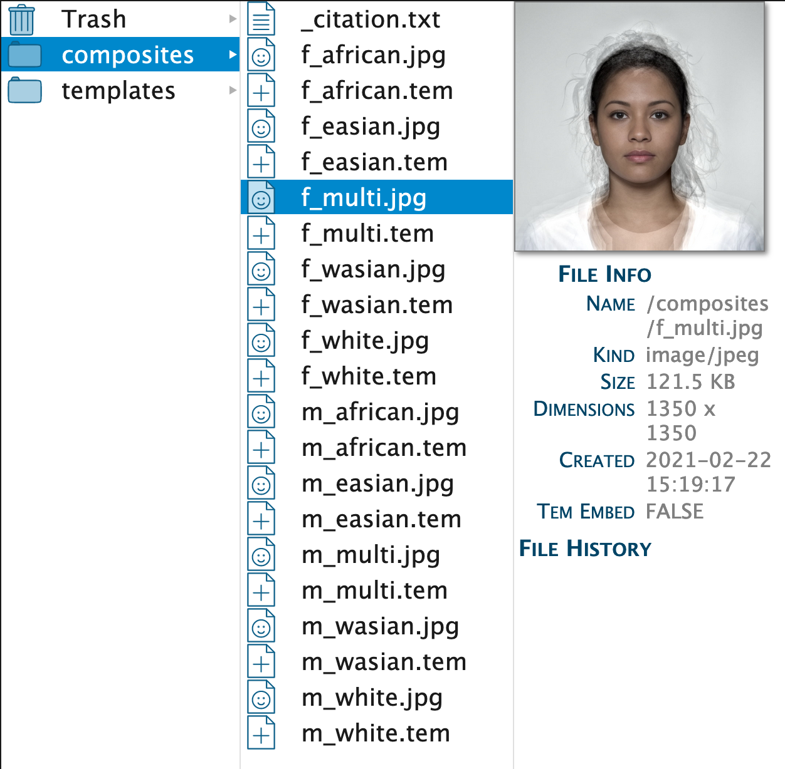

# Getting Started

## Accounts

### Academic Accounts

If you have an academic email address, you should be able to sign up for a free account and be authorised automatically. If your email isn't automatically recognised as academic, email Lisa and ask to be authorised. You will receive your password in an email (check the spam folder if it doesn't arrive in a few minutes).

<div class="info">
These accounts have 265 MB of permanent storage. Contact Lisa if you really need more, but you can always download your files and re-upload them later.
</div>

### Waitlist

There is a currently a waitlist for non-academics. The reason is that letting anyone who wants an account have one would overwhelm the system. We don't currently have any funding, but am to apply for some and expand our capacity as soon as possible.

### Guest Accounts

Anyone can access a guest account. These accounts have limited temporary storage (128 MB) and no permanent storage. You need to download any files you want to keep before you log out. 

### Log in

Once you have your password, log in from the main website page. 

<div class="info">
This web application is a single-page app (which has some advantages for using it on a tablet), but emulates a multi-page app using "fragment identifiers". For example, you can access a file called "f_multi.jpg" in the folder called "composites" in the Finder interface for project 1 at  "https://webmorph.org/#F1/composites/f_multi.jpg" (or you could if you were logged in a someone with permission to access that project)
</div>

## Projects

When you first log in, you are taken to the Projects page. This page will show all your projects and an overview of their storage and your total allocation.

Double-click on a project name or description in the project list to edit it.

Click on the last column to add or delete users. Start typing a name or email address and wait for the auto-complete to show you a list of matching users.
<!-- FIX: make process nicer -->
Select the user you want to add and press Return. The list will reload and then you can click on the last column to check they have been added. An "A" next to the name means they have all permissions to add, delete, and change files. Click on the "A" to change it to "R" for read-only permissions. Click on the "-" to remove this user. Adding users to your project doesn't affect their allocation and you can't remove yourself from a project.

Click on `Go` to load your first project. 

## Finder

Projects open in the Finder interface, which is a file navigation interface like the Mac OS Finder or Windows Explorer. New projects come with two folders: `composites` and `templates`. You can also see the Trash (which you can hide under the View menu).

Click on the `composites` folder and select an image. You should see some file information, including the image dimensions, the date the file was created, and whether it has an embedded template.


```r

```

<div class="figure">

<p class="caption">(\#fig:fig-finder)Finder window</p>
</div>

If you click on a template file (e.g., "f_multi.tem") you will see similar file information, as well as a small window with the template text. You will probably not ever need to work with these numbers directly, but they are human-readable.

You can upload text files (.txt) to WebMorph for your own records. Their text also displays in the small window if you click on them, but you can't edit them in WebMorph.

The "templates" folder contains tab-separated text files that are used for [batch processing](#batch-processing).

### Adding Folders and Files

Create a new folder in the base of your project by clicking underneath all of the folder names to close nay open folders. Then choose New Folder from the File menu (shift-cmd-N). Type the new folder name into the pop-up window and click Save.

Add files from your computer by choosing Upload from the File menu (cmd-U). You can select multiple files, but not folders to upload. You cannot upload from a zip file yet.

### Uploading from Webcam

You can also upload images from a webcam (shift-cmd-U). This will bring up a window with the image from your webcam (you may need to give webmorph access first through some permissions pop-ups). Line up your face approximately with the superimposed template and press return to capture the image. Type in a file name and click Save to save it.

### Deleting Files

Select files (cms-click or shift-click to select multiple files, or use cmd-A to select all files in a folder) and choose Move to Trash from the File menu (cmd-delete). Shift-cmd-delete skips the confirmation dialog.

<div class="warning">
At the moment, you can only delete empty folders, so you will be prompted to delete all files in a folder first. I know this is pretty tedious and will work on a way to safely delete folders. Deleting a lot of files can also be quite slow and I'm looking into it.
</div>

### Moving/Renaming files

The best way to move files is to cut (cmd-X) or copy (cmd-C) and paste (cmd-V) selected files.

<div class="warning">
You can drag files into another folder, but this can be buggy and I might remove it soon.
</div>

Select a file or folder and press Enter, edit the name, and press Enter to accept the new name (or click outside the file to cancel). If you change an image file's name, its associate tem file name will also change.

<div class="info">
If the finder interface starts to look weird or isn't updating the way you think it should, that's probably a bug. Choose Refresh under the View menu (cmd-R) to reload the Finder.
</div>

## Delineate

Double-click on an image or .tem file to open it in the delineation window. The delineation toolbar should be visible. If it's not, choose Delineation Toolbar in the View menu. The question mark button in the toolbar shows a pop-up of helpful hints.

### Fit Template

If an image file does not have an associated template, you will be prompted to 3-point delineate it. A prompt will show in the delineation toolbar to remind you where to click (usually left eye, right eye, and centre of the bottom of the upper lip). If you mess this up, just repeat it by choosing Fit Template from the Template menu (opt-F).

### Change Size

You may want to change the size of the image first. You can do this with the buttons in the delineation toolbar or command keys. 

* cmd-plus: increase size
* cmd-minus: decrease size
* cmd-0: original size
* cmd-M: fit to the window

### Auto-Delineation

You can automatically delineate a face with the 83-point Face++ template by choosing Auto-Delineate from the Template menu (opt-D). You can auto-delineate a batch of images by selecting them in the Finder and doing the same.

<div class="warning">
Don't auto-delineate image that already have template. Delete those files first. If any images in a batch fail (check the Queue menu item), this might be because Face++ is limiting the number of concurrent sessions. Just try to auto-delineate those images again in a minute or two.
</div>

### Delineation

Click on each point and drag it to fit the template to the face. The point number, label, x and y coordinate are shown in the bottom left of the window when you move points. The name of the image is in the bottom right.


```r

```

<div class="figure">

<p class="caption">(\#fig:fig-delin)Delineation window.</p>
</div>

* Drag each point to delineate the shape of the image.
* shift-click on a point to select or unselect it.
* cmd-click or opt-click on a point to select or unselect the whole line.
* Hold shift and drag over the image select all points inside the box.
* Move a group of selected points by moving any selected point with the mouse or using the arrow keys.
* opt+ and opt- to increase or decrease the size of a selected group of delineation points.
* opt-← and opt-→ to rotate a selected group of delineation points.
* cmd-A (or double-click on the image) to unselect all points.


### Save Template

Choose Save from the File menu (cmd-S) to save the template. It will automatically save with the same name as the associated image.

If you want to scroll through a folder of images, click the Next image (fast forward) button on the delineation toolbar (cmd-→).


