# Batch Processes


## Batch Functions

Select multiple images in the Finder and use the functions under the Batch menu to apply transformations to all of the selected images. The individual processes will be added to the Queue and complete in the background.

<div class="try">
I am writing an [R package](https://facelab.github.io/webmorphR/) to do much of this on your own computer, which can often be faster than the webmorph server. 
</div>

### Rename

Replace text, add a prefix or suffix, or add an index to selected images.

<div class="figure">
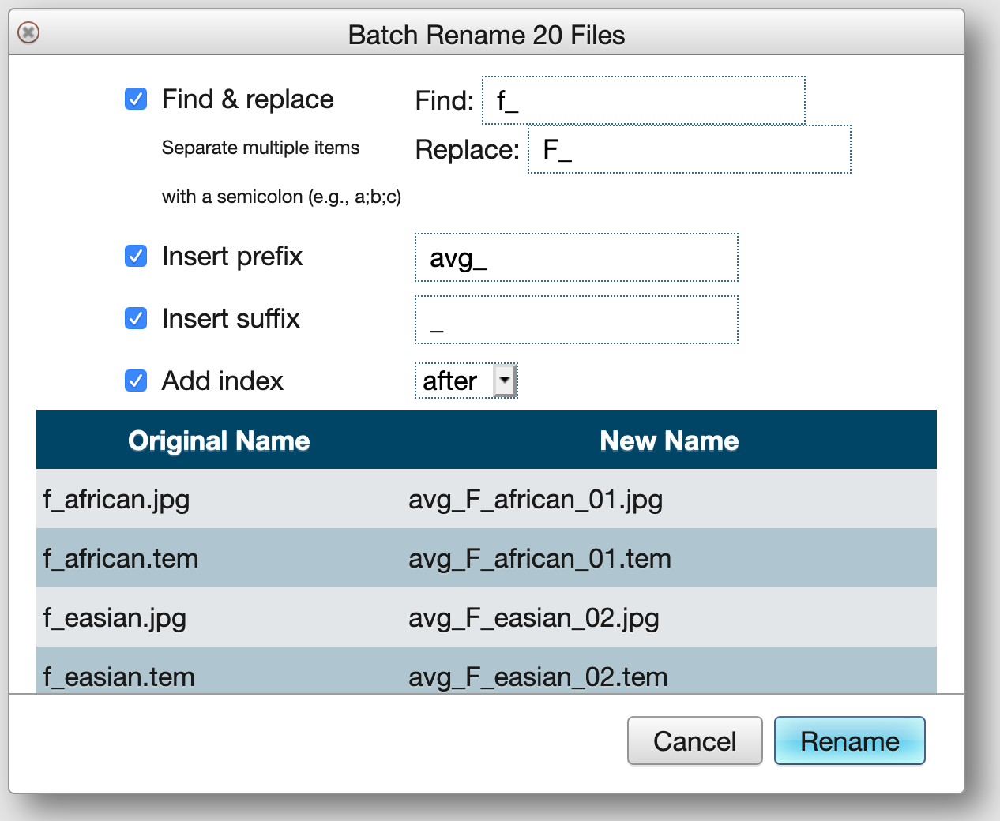
<p class="caption">(\#fig:fig-batch-rename)Batch Rename.</p>
</div>

### Align

Align delineated images on two points. This rotates and resizes images so that the specified points are all in the same place (usually the pupils). 

The default values for the alignment come from [Preferences](#prefs-default-alignment), but you can change them. 

If the alignment makes an image smaller than the image size, the background will be the specified colour.

<div class="figure">
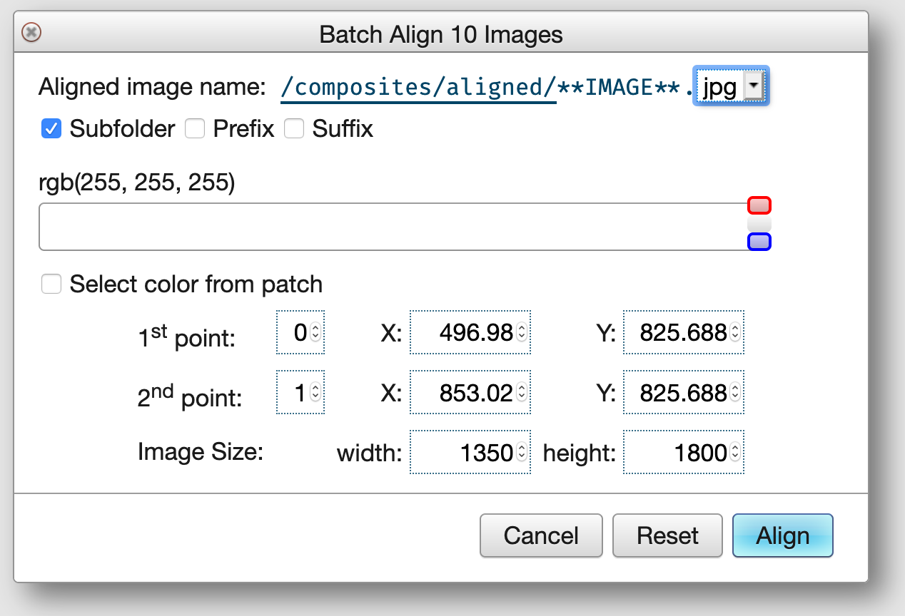
<p class="caption">(\#fig:fig-batch-align)Batch Align.</p>
</div>

### Crop

Crop an image by specifying the number of pixels to add or remove from each side.

You can select the background colour for added pixels from the average of a patch of the image whose coordinates you specify (defaulting to the top left 10 pixel square).

<div class="figure">
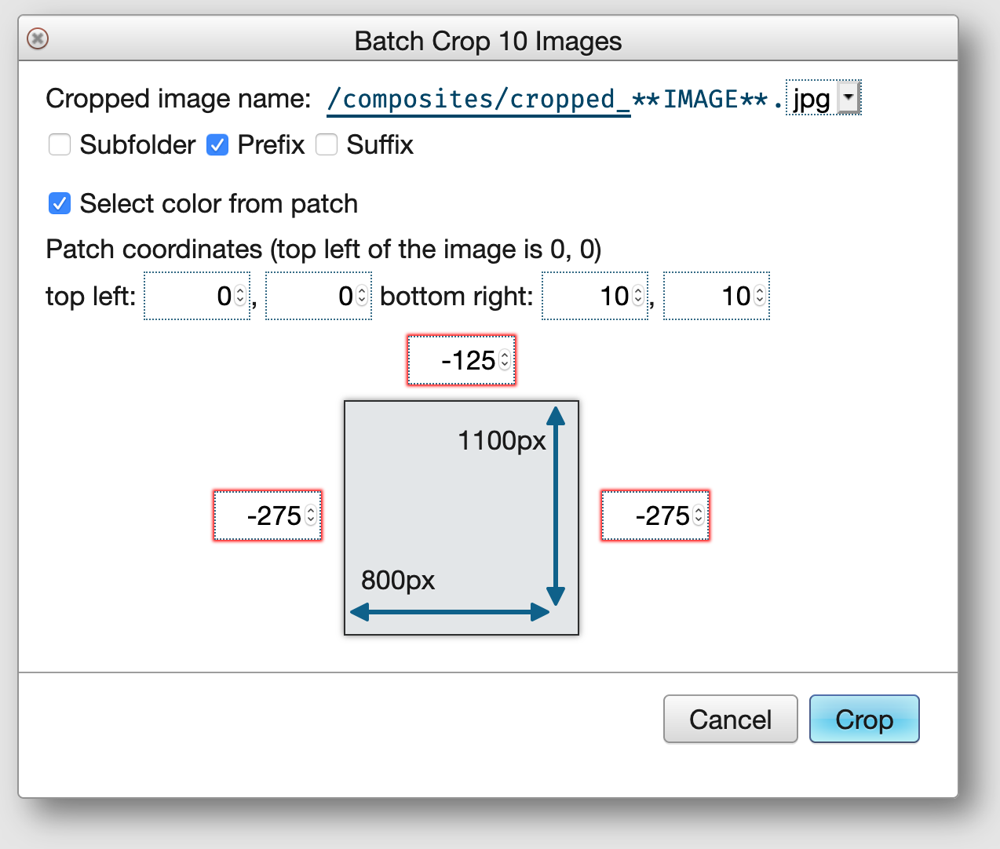
<p class="caption">(\#fig:fig-batch-crop)Batch Crop.</p>
</div>

### Mask

Masking allows you to use the delineation lines to mask off areas of an image. There are several masks built into WebMorph that work with the FRL-Face template, but you can define your own.

<div class="figure">
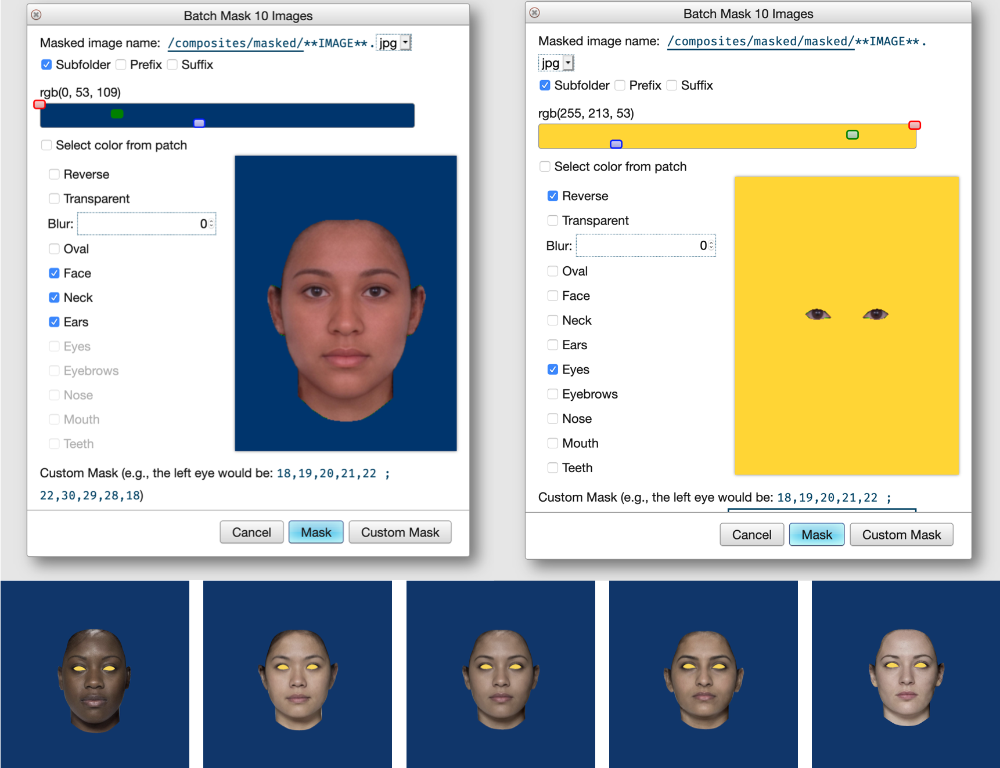
<p class="caption">(\#fig:fig-batch-mask)Batch Mask.</p>
</div>

You can combine masks. The interface will let you visualise what each mask is. Reversing a mask puts the colour inside the mask instead of outside (although the masking interface still shows an external mask, sorry). If you set the mask to transparent, the masked images will be PNGs with transparency.

<div class="bug">
The blur function doesn't work as well as PsychMorph's and you usually can't tell the difference with images that are large.
</div>

You can create a custom mask by unselecting all of the built-in masks and directly typing the points to use in the text box that appears. For example, with the custom 10-point template ["outline"](#from-scratch), you can mask the face with this: `0,1,2,3,4,5,6,7,8,9,0`. Notice how the first point is also appended to the end. If you don't do this, masks will have a jagged corner.

<div class="figure">
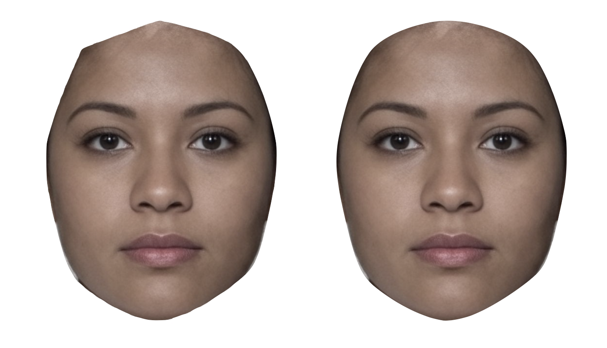
<p class="caption">(\#fig:fig-batch-mask-custom)Custom Masks.  The image on the left didn't include the starting point at the end.</p>
</div>

You can build a mask by clicking on the delineation points you want to add in the Template interface. Load an image with the correct template and choose Custom Mask Builder from the Template menu. Click on points to add them to the text box. Separate points with commas, lines with semicolons, and mask areas with colons.

<div class="bug">
You can't get out of the Custom Mask Builder interface. Until I fix it, just reload the page to get out.
</div>

For example, this will create one mask that masks the pupils, as the points 2-9 delineate the left pupil and points 10-17 delineate the right pupil. Reverse the mask to replace the pupils with the mask colour.

```
2,3,4,5,6,7,8,9,2 : 10,17,16,15,14,13,12,11,10
```


### Mirror

Batch mirror mirror-reverses the images and their templates. Templates need to have their symmetry points defined in order to do this. Most of the built-in templates in WebMorph have this, but you will need to [do this yourself](#template-sym) for any custom templates.

For example, in the FRL-Face template, point 0 is the left pupil and point 1 is the right pupil, so in the mirror-reversed version, the x-coordinates are all flipped and the identities of matching points are swapped so that the pupil point on the left side of the image is 0 in both original and mirror-reversed versions. This is the first step to creating a symmetric face.

### Resize

Resize images by percent or pixel. If you only enter one of width or height, the other dimension is scaled to the same aspect ratio as the original image. You will see a table of the original and new dimensions to check before you click Resize.

<div class="figure">
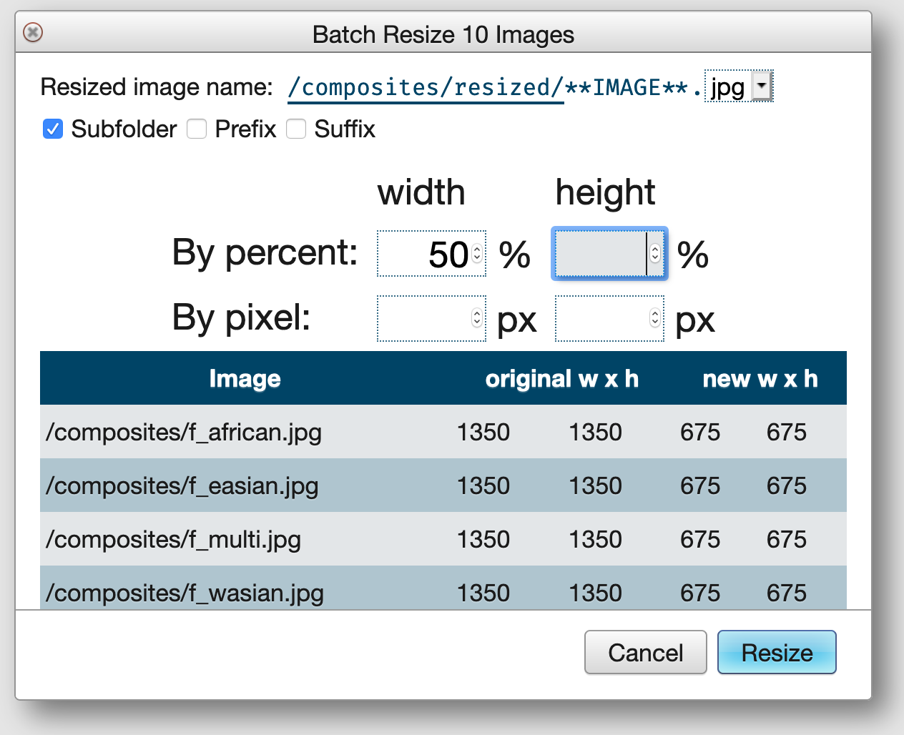
<p class="caption">(\#fig:fig-batch-resize)Batch Resize</p>
</div>

### Rotate

Set the number of degrees to rotate (e.g. 90 degrees rotates the images one-quarter of a turn clockwise). 

If your rotated image is squint, you need to set a background colour to fill in the triangles in the edges. If you choose "Select color from patch", each image's background will be taken from the average of the specified pixels.

<div class="figure">
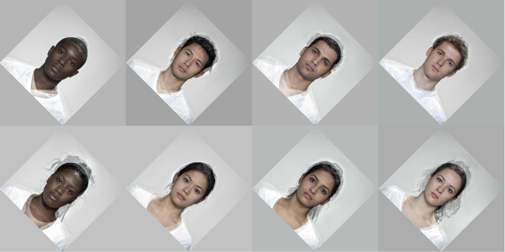
<p class="caption">(\#fig:fig-batch-rotate)Batch Rotate 45 degrees with Select color from patch</p>
</div>

### Scramble

Some vision research uses scrambled images as controls. They will have the same distribution of colour as the unscrambled image, but scrambling introduces horizontal and vertical structure that isn't present in the original image, so we recommend to place grid lines on both the original and scrambled images.

Scramble an image by choosing the grid size and offset, then select/unselect the squares to scramble by clicking or dragging on the image. 

If your selected squares are symmetric, you can choose a symmetric scramble, where the squares on the left side are scrambled, and the squares on the right side are in a mirrored pattern. This looks pretty creepy, but maintains the bilateral symmetry of the original image in the scrambled version. Each face in a set is scrambled 

<div class="figure">

<p class="caption">(\#fig:fig-batch-scramble)Batch Scramble</p>
</div>

The symmetric image scrambling methods were first published in Conway et al. [-@conway_2008], so please do cite that paper if you use this method.

You can scramble only inside a masked area, although this is experimental and sometimes is glitchy. Set the grid size fairly small and turn off grid lines to create a pixelated look.

<div class="figure">
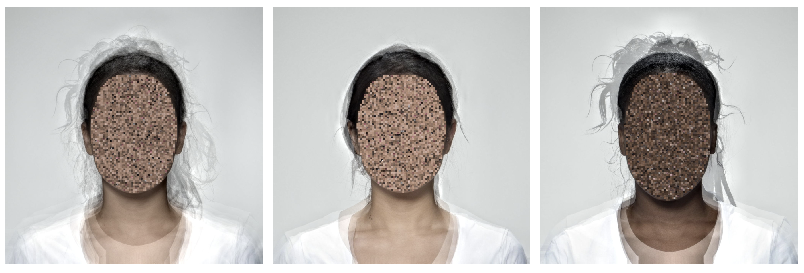
<p class="caption">(\#fig:fig-batch-scramble-mask)Batch Scramble inside a mask.</p>
</div>

### Symmetrise

You can symmetrise an image in shape, color, or both. Just like batch mirroring, templates need to have their symmetry points defined in order to do this. Most of the built-in templates in WebMorph have this, but you will need to [do this yourself](#template-sym) for any custom templates.

<div class="figure">
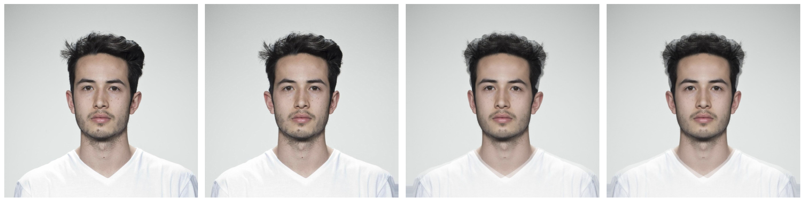
<p class="caption">(\#fig:fig-batch-sym)Batch Symmetrise. Original image, symmetric shape, symmetric colour, and both.</p>
</div>

## Batch Files

WebMorph has three types of batch files that let you process many images programmatically.

### Batch Average

[Batch Average Template](https://webmorph.org/include/examples/templates/_batchAvg.txt)

Put the name of each average on the first row and the images in the average in the rows below. Put each average in a new column.

In the example below, the first average is made from two images (m_multi and f_multi) and will be saved in a folder called avg_test as androgynous.jpg. The second example will be made from 4 images, 3 of which are the same (so will be 1/4 f_multi and 3/4 m_multi).

<table>
 <thead>
  <tr>
   <th style="text-align:left;"> /avg_test/androgynous.jpg </th>
   <th style="text-align:left;"> /avg_test/3male1female.jpg </th>
  </tr>
 </thead>
<tbody>
  <tr>
   <td style="text-align:left;"> /composites/m_multi.jpg </td>
   <td style="text-align:left;"> /composites/f_multi.jpg </td>
  </tr>
  <tr>
   <td style="text-align:left;"> /composites/f_multi.jpg </td>
   <td style="text-align:left;"> /composites/m_multi.jpg </td>
  </tr>
  <tr>
   <td style="text-align:left;">  </td>
   <td style="text-align:left;"> /composites/m_multi.jpg </td>
  </tr>
  <tr>
   <td style="text-align:left;">  </td>
   <td style="text-align:left;"> /composites/m_multi.jpg </td>
  </tr>
</tbody>
</table>


### Batch Transform

[Batch Transform Template](https://webmorph.org/include/examples/templates/_batchTrans.txt)

<table>
 <thead>
  <tr>
   <th style="text-align:left;"> trans-img </th>
   <th style="text-align:left;"> from-img </th>
   <th style="text-align:left;"> to-img </th>
   <th style="text-align:left;"> shape </th>
   <th style="text-align:left;"> color </th>
   <th style="text-align:left;"> texture </th>
   <th style="text-align:left;"> outname </th>
  </tr>
 </thead>
<tbody>
  <tr>
   <td style="text-align:left;"> /composites/f_multi.jpg </td>
   <td style="text-align:left;"> /composites/m_multi.jpg </td>
   <td style="text-align:left;"> /composites/f_multi.jpg </td>
   <td style="text-align:left;"> 50 </td>
   <td style="text-align:left;"> 0 </td>
   <td style="text-align:left;"> 0 </td>
   <td style="text-align:left;"> /trans_test/female_fem50.jpg </td>
  </tr>
  <tr>
   <td style="text-align:left;"> /composites/f_multi.jpg </td>
   <td style="text-align:left;"> /composites/m_multi.jpg </td>
   <td style="text-align:left;"> /composites/f_multi.jpg </td>
   <td style="text-align:left;"> -50 </td>
   <td style="text-align:left;"> 0 </td>
   <td style="text-align:left;"> 0 </td>
   <td style="text-align:left;"> /trans_test/female_masc50.jpg </td>
  </tr>
  <tr>
   <td style="text-align:left;"> /composites/m_multi.jpg </td>
   <td style="text-align:left;"> /composites/m_multi.jpg </td>
   <td style="text-align:left;"> /composites/f_multi.jpg </td>
   <td style="text-align:left;"> 50 </td>
   <td style="text-align:left;"> 0 </td>
   <td style="text-align:left;"> 0 </td>
   <td style="text-align:left;"> /trans_test/male_fem50.jpg </td>
  </tr>
  <tr>
   <td style="text-align:left;"> /composites/m_multi.jpg </td>
   <td style="text-align:left;"> /composites/m_multi.jpg </td>
   <td style="text-align:left;"> /composites/f_multi.jpg </td>
   <td style="text-align:left;"> -50 </td>
   <td style="text-align:left;"> 0 </td>
   <td style="text-align:left;"> 0 </td>
   <td style="text-align:left;"> /trans_test/male_masc50.jpg </td>
  </tr>
  <tr>
   <td style="text-align:left;"> /composites/f_white.jpg </td>
   <td style="text-align:left;"> /composites/f_multi.jpg </td>
   <td style="text-align:left;"> /composites/f_white.jpg </td>
   <td style="text-align:left;"> 25% </td>
   <td style="text-align:left;"> 25% </td>
   <td style="text-align:left;"> 25% </td>
   <td style="text-align:left;"> /trans_test/f_wh_caric.jpg </td>
  </tr>
</tbody>
</table>

### Batch Edit

[Batch Edit Template](https://webmorph.org/include/examples/templates/_batchEdit.txt)

The batch edit function lets you align, resize, rotate, crop, mask, symmetrise, and/or mirror images in any order.  Every row must have a valid `image` name of an image that exists in your project, and a valid `outname` that can't overwrite an existing image.


* image: The path to the image file: e.g., `/male/avg.jpg`
* align: `pt1, pt2, x1, y1, x2, y2, width, height, [color]`
    e.g., `0,1,497,825,853,825,1350,1800,rgb(0,0,0)` or `DEFAULT`
* resize: `width, height`
    e.g., `50%,50%` or `300px,400px` or `null,400px`
* rotate: `degrees, [color]`
    e.g., `90,rgb(255,255,255)`
* crop: `top, right, bottom, left, [color]`
    e.g., `-100,100,-100,100,rgb(0,0,0)`
* mask: `(mask names or custom mask), blur, [color]`
    e.g., `(face,neck,ears),0,rgb(255,255,255)` or `(face),10,transparent`
* sym: `shape` and/or `color`
* mirror: `true` or leave blank
* order: defaults to `align,resize,rotate,crop,mask,sym,mirror`
* outname: The path to save the result to: e.g., `/male/edited/avg.jpg` 
The file needs all 10 columns with their headers, but I'll show each batch function below with only the relevant columns.

#### Align

Align using your [default alignment](#prefs-default-alignment) (`DEFAULT`), the default FRL-face alignment (`FRL`), or the specified alignment in the order `point 1, point 2, x1, y1, x2, y2, width, height`.

<table>
 <thead>
  <tr>
   <th style="text-align:left;"> image </th>
   <th style="text-align:left;"> align </th>
   <th style="text-align:left;"> outname </th>
  </tr>
 </thead>
<tbody>
  <tr>
   <td style="text-align:left;"> /composites/f_multi.jpg </td>
   <td style="text-align:left;"> DEFAULT </td>
   <td style="text-align:left;"> /edit_test/align_default.jpg </td>
  </tr>
  <tr>
   <td style="text-align:left;"> /composites/f_easian.jpg </td>
   <td style="text-align:left;"> FRL </td>
   <td style="text-align:left;"> /edit_test/align_frl.jpg </td>
  </tr>
  <tr>
   <td style="text-align:left;"> /composites/f_african.jpg </td>
   <td style="text-align:left;"> 0,1,200,300,400,300,600,600 </td>
   <td style="text-align:left;"> /edit_test/align_square.jpg </td>
  </tr>
</tbody>
</table>

#### Resize

Resize images with a single percentage, or width and height as pixels or percentages. To omit width or height, use `null`.

<table>
 <thead>
  <tr>
   <th style="text-align:left;"> image </th>
   <th style="text-align:left;"> resize </th>
   <th style="text-align:left;"> outname </th>
  </tr>
 </thead>
<tbody>
  <tr>
   <td style="text-align:left;"> /composites/f_white.jpg </td>
   <td style="text-align:left;"> 50% </td>
   <td style="text-align:left;"> /edit_test/resize_50_percent.jpg </td>
  </tr>
  <tr>
   <td style="text-align:left;"> /composites/f_wasian.jpg </td>
   <td style="text-align:left;"> null,400px </td>
   <td style="text-align:left;"> /edit_test/resize_400px_tall.jpg </td>
  </tr>
  <tr>
   <td style="text-align:left;"> /composites/m_multi.jpg </td>
   <td style="text-align:left;"> 200px,200px </td>
   <td style="text-align:left;"> /edit_test/resize_200x200px.jpg </td>
  </tr>
  <tr>
   <td style="text-align:left;"> /composites/m_easian.jpg </td>
   <td style="text-align:left;"> 300px,null </td>
   <td style="text-align:left;"> /edit_test/resize_300px_wide.jpg </td>
  </tr>
  <tr>
   <td style="text-align:left;"> /composites/m_african.jpg </td>
   <td style="text-align:left;"> 50%,25% </td>
   <td style="text-align:left;"> /edit_test/resize_50x25_percent.jpg </td>
  </tr>
</tbody>
</table>

#### Rotate

Rotate images with the degrees to rotate. If you need to set a non-default background color, add this after the rotation value in the format `rgb(r, g, b)`.

<table>
 <thead>
  <tr>
   <th style="text-align:left;"> image </th>
   <th style="text-align:left;"> rotate </th>
   <th style="text-align:left;"> outname </th>
  </tr>
 </thead>
<tbody>
  <tr>
   <td style="text-align:left;"> /composites/m_white.jpg </td>
   <td style="text-align:left;"> 90 </td>
   <td style="text-align:left;"> /edit_test/rotate_90.jpg </td>
  </tr>
  <tr>
   <td style="text-align:left;"> /composites/m_wasian.jpg </td>
   <td style="text-align:left;"> 45,rgb(255,0,0) </td>
   <td style="text-align:left;"> /edit_test/rotate_45red.jpg </td>
  </tr>
  <tr>
   <td style="text-align:left;"> /composites/f_multi.jpg </td>
   <td style="text-align:left;"> -90 </td>
   <td style="text-align:left;"> /edit_test/rotate_neg90.jpg </td>
  </tr>
</tbody>
</table>

#### Crop

Crop images by setting the top, right, bottom and left pixels. Set a non-default background color in the format `rgb(r, g, b)`.

<table>
 <thead>
  <tr>
   <th style="text-align:left;"> image </th>
   <th style="text-align:left;"> crop </th>
   <th style="text-align:left;"> outname </th>
  </tr>
 </thead>
<tbody>
  <tr>
   <td style="text-align:left;"> /composites/f_multi.jpg </td>
   <td style="text-align:left;"> -300,0,-300,0 </td>
   <td style="text-align:left;"> /edit_test/crop_short.jpg </td>
  </tr>
  <tr>
   <td style="text-align:left;"> /composites/f_multi.jpg </td>
   <td style="text-align:left;"> 100,100,100,100,rgb(0,255,0) </td>
   <td style="text-align:left;"> /edit_test/crop_green_border.jpg </td>
  </tr>
</tbody>
</table>

#### Mask

Put the mask names inside parentheses (comma-delimited), then the blur level (0-10), and an optional background color in the format `rgb(r, g, b)`.

<table>
 <thead>
  <tr>
   <th style="text-align:left;"> image </th>
   <th style="text-align:left;"> mask </th>
   <th style="text-align:left;"> outname </th>
  </tr>
 </thead>
<tbody>
  <tr>
   <td style="text-align:left;"> /composites/f_multi.jpg </td>
   <td style="text-align:left;"> (face),10,rgb(255,0,0) </td>
   <td style="text-align:left;"> /edit_test/mask_red.jpg </td>
  </tr>
  <tr>
   <td style="text-align:left;"> /composites/f_multi.jpg </td>
   <td style="text-align:left;"> (face),0,rgb(0,255,0) </td>
   <td style="text-align:left;"> /edit_test/mask_green.jpg </td>
  </tr>
  <tr>
   <td style="text-align:left;"> /composites/f_multi.jpg </td>
   <td style="text-align:left;"> (face,neck,ears),0 </td>
   <td style="text-align:left;"> /edit_test/mask_face_neck_ears.jpg </td>
  </tr>
  <tr>
   <td style="text-align:left;"> /composites/f_multi.jpg </td>
   <td style="text-align:left;"> (neck),0 </td>
   <td style="text-align:left;"> /edit_test/mask_neck.jpg </td>
  </tr>
  <tr>
   <td style="text-align:left;"> /composites/f_multi.jpg </td>
   <td style="text-align:left;"> (left_eye),0 </td>
   <td style="text-align:left;"> /edit_test/mask_left_eye.jpg </td>
  </tr>
  <tr>
   <td style="text-align:left;"> /composites/f_multi.jpg </td>
   <td style="text-align:left;"> (right_eye),0 </td>
   <td style="text-align:left;"> /edit_test/mask_right_eye.jpg </td>
  </tr>
  <tr>
   <td style="text-align:left;"> /composites/f_multi.jpg </td>
   <td style="text-align:left;"> (eyes),0 </td>
   <td style="text-align:left;"> /edit_test/mask_eyes.jpg </td>
  </tr>
  <tr>
   <td style="text-align:left;"> /composites/f_multi.jpg </td>
   <td style="text-align:left;"> (left_brow),0 </td>
   <td style="text-align:left;"> /edit_test/mask_left_brow.jpg </td>
  </tr>
  <tr>
   <td style="text-align:left;"> /composites/f_multi.jpg </td>
   <td style="text-align:left;"> (right_brow),0 </td>
   <td style="text-align:left;"> /edit_test/mask_right_brow.jpg </td>
  </tr>
  <tr>
   <td style="text-align:left;"> /composites/f_multi.jpg </td>
   <td style="text-align:left;"> (brows),0 </td>
   <td style="text-align:left;"> /edit_test/mask_brows.jpg </td>
  </tr>
  <tr>
   <td style="text-align:left;"> /composites/f_multi.jpg </td>
   <td style="text-align:left;"> (left_ear),0 </td>
   <td style="text-align:left;"> /edit_test/mask_left_ear.jpg </td>
  </tr>
  <tr>
   <td style="text-align:left;"> /composites/f_multi.jpg </td>
   <td style="text-align:left;"> (right_ear),0 </td>
   <td style="text-align:left;"> /edit_test/mask_right_ear.jpg </td>
  </tr>
  <tr>
   <td style="text-align:left;"> /composites/f_multi.jpg </td>
   <td style="text-align:left;"> (ears),0 </td>
   <td style="text-align:left;"> /edit_test/mask_ears.jpg </td>
  </tr>
  <tr>
   <td style="text-align:left;"> /composites/f_multi.jpg </td>
   <td style="text-align:left;"> (nose),0 </td>
   <td style="text-align:left;"> /edit_test/mask_nose.jpg </td>
  </tr>
  <tr>
   <td style="text-align:left;"> /composites/f_multi.jpg </td>
   <td style="text-align:left;"> (mouth),0 </td>
   <td style="text-align:left;"> /edit_test/mask_mouth.jpg </td>
  </tr>
</tbody>
</table>

#### Sym

Symmetrise with `shape` and/or `color`, separated by a comma.

<table>
 <thead>
  <tr>
   <th style="text-align:left;"> image </th>
   <th style="text-align:left;"> sym </th>
   <th style="text-align:left;"> outname </th>
  </tr>
 </thead>
<tbody>
  <tr>
   <td style="text-align:left;"> /composites/f_multi.jpg </td>
   <td style="text-align:left;"> shape,color </td>
   <td style="text-align:left;"> /edit_test/sym_shape_color.jpg </td>
  </tr>
  <tr>
   <td style="text-align:left;"> /composites/f_multi.jpg </td>
   <td style="text-align:left;"> shape </td>
   <td style="text-align:left;"> /edit_test/sym_shape.jpg </td>
  </tr>
  <tr>
   <td style="text-align:left;"> /composites/f_multi.jpg </td>
   <td style="text-align:left;"> color </td>
   <td style="text-align:left;"> /edit_test/sym_color.jpg </td>
  </tr>
</tbody>
</table>

#### Mirror

Mirror with `TRUE`, `FALSE`, or leave blank.

<table>
 <thead>
  <tr>
   <th style="text-align:left;"> image </th>
   <th style="text-align:left;"> mirror </th>
   <th style="text-align:left;"> outname </th>
  </tr>
 </thead>
<tbody>
  <tr>
   <td style="text-align:left;"> /composites/f_multi.jpg </td>
   <td style="text-align:left;"> TRUE </td>
   <td style="text-align:left;"> /edit_test/mirror.jpg </td>
  </tr>
</tbody>
</table>

#### Multiple

You can apply several edits to a single image in one step.

<div style="border: 0px;overflow-x: scroll; width:100%; "><table>
 <thead>
  <tr>
   <th style="text-align:left;"> image </th>
   <th style="text-align:left;"> align </th>
   <th style="text-align:left;"> resize </th>
   <th style="text-align:left;"> rotate </th>
   <th style="text-align:left;"> crop </th>
   <th style="text-align:left;"> mask </th>
   <th style="text-align:left;"> sym </th>
   <th style="text-align:left;"> mirror </th>
   <th style="text-align:left;"> order </th>
   <th style="text-align:left;"> outname </th>
  </tr>
 </thead>
<tbody>
  <tr>
   <td style="text-align:left;"> /composites/f_multi.jpg </td>
   <td style="text-align:left;"> FRL </td>
   <td style="text-align:left;"> 50% </td>
   <td style="text-align:left;"> 90 </td>
   <td style="text-align:left;"> 10,10,10,10,rgb(255,0,0) </td>
   <td style="text-align:left;"> (face),0,rgb(255,255,255) </td>
   <td style="text-align:left;"> shape,color </td>
   <td style="text-align:left;"> FALSE </td>
   <td style="text-align:left;">  </td>
   <td style="text-align:left;"> /edit_test/multi_1a.jpg </td>
  </tr>
  <tr>
   <td style="text-align:left;"> /composites/f_multi.jpg </td>
   <td style="text-align:left;"> FRL </td>
   <td style="text-align:left;"> 50% </td>
   <td style="text-align:left;"> 90 </td>
   <td style="text-align:left;"> 10,10,10,10,rgb(255,0,0) </td>
   <td style="text-align:left;"> (face),0,rgb(255,255,255) </td>
   <td style="text-align:left;"> shape,color </td>
   <td style="text-align:left;"> FALSE </td>
   <td style="text-align:left;"> align,resize,rotate,crop,mask,sym </td>
   <td style="text-align:left;"> /edit_test/multi_1b.jpg </td>
  </tr>
  <tr>
   <td style="text-align:left;"> /composites/f_multi.jpg </td>
   <td style="text-align:left;"> FRL </td>
   <td style="text-align:left;"> 50% </td>
   <td style="text-align:left;"> 90 </td>
   <td style="text-align:left;"> 10,10,10,10,rgb(255,0,0) </td>
   <td style="text-align:left;"> (face),0,rgb(255,255,255) </td>
   <td style="text-align:left;"> shape,color </td>
   <td style="text-align:left;"> FALSE </td>
   <td style="text-align:left;"> resize,rotate,crop,mask,sym,align </td>
   <td style="text-align:left;"> /edit_test/multi_2.jpg </td>
  </tr>
  <tr>
   <td style="text-align:left;"> /composites/f_multi.jpg </td>
   <td style="text-align:left;"> FRL </td>
   <td style="text-align:left;"> 50% </td>
   <td style="text-align:left;"> 90 </td>
   <td style="text-align:left;"> 10,10,10,10,rgb(255,0,0) </td>
   <td style="text-align:left;"> (face),0,rgb(255,255,255) </td>
   <td style="text-align:left;"> shape,color </td>
   <td style="text-align:left;"> FALSE </td>
   <td style="text-align:left;"> crop,resize,sym,align </td>
   <td style="text-align:left;"> /edit_test/multi_3.jpg </td>
  </tr>
  <tr>
   <td style="text-align:left;"> /composites/f_multi.jpg </td>
   <td style="text-align:left;"> 0,1,200,300,400,300,600,600 </td>
   <td style="text-align:left;"> 50% </td>
   <td style="text-align:left;"> 90 </td>
   <td style="text-align:left;"> 10,10,10,10,rgb(255,0,0) </td>
   <td style="text-align:left;"> (face),0,rgb(255,255,255) </td>
   <td style="text-align:left;"> shape,color </td>
   <td style="text-align:left;"> FALSE </td>
   <td style="text-align:left;"> crop </td>
   <td style="text-align:left;"> /edit_test/multi_4.jpg </td>
  </tr>
  <tr>
   <td style="text-align:left;"> /composites/f_multi.jpg </td>
   <td style="text-align:left;"> 0,1,200,300,400,300,600,600 </td>
   <td style="text-align:left;"> 50% </td>
   <td style="text-align:left;"> 90 </td>
   <td style="text-align:left;"> 10,10,10,10,rgb(255,0,0) </td>
   <td style="text-align:left;"> (face),0,rgb(255,255,255) </td>
   <td style="text-align:left;"> shape,color </td>
   <td style="text-align:left;"> FALSE </td>
   <td style="text-align:left;"> crop,crop </td>
   <td style="text-align:left;"> /edit_test/multi_5.jpg </td>
  </tr>
</tbody>
</table></div>

## Other Functions

### Calculate FacialMetrics {#facialmetrics}

Use the x and y coordinates of templates to calculate facial metrics.

There are two built-in metrics:

* FWH: face width-to height ratio, face height is the distance between the upper lip and the highest point of the eyelids, face width is the maximum distance between the left and right facial boundary (i.e., bizygomatic width) [following @FWH]

    ```
    abs(max(x[113],x[112],x[114])-min(x[110],x[111],x[109]))/abs(y[90]-min(y[20],y[25]))
    ```

* Eye-spacing: the distance between the centres of the pupils (this isn't very useful, but mainly there to remind you of the equation for the distance between two points)

    ```
    sqrt(pow(x[0]-x[1], 2) + pow(y[0]-y[1],2))
    ```

Click calculate after choosing a metric to add its calculation to a table for downloading. 

You can also write your own equations. refer to points by their number, e.g., `x[0]` or `y[1]`. You can find the point numbers by hovering over them in the Delineate window.

Allowed functions in equations are: `abs`, `min`, `max`, `tan`, `sin`, `cos`, `atan`, `asin`, `acos`, `sqrt`, `pow` and `rad2deg`. Units are in pixels. The origin (0,0) is in the upper left corner.

Max and min values of template points can be useful for knowing how much you can crop a set of images without going into the templates. Here are the relevant points for the FRL-Face template.

* Top: y of the highest halo point, `y[151]`
* Bottom: minimum y of the adams apple points, `max(y[183], y[184])`
* Left: x of left halo point outside the ear, `x[147]`
* Right: x of right halo point outside the ear, `x[155]`

If you're using the [Hand template](#default-tem), you can calculate 2D4D (the ratio of the second to fourth digit) with the following equation:

```
sqrt(pow(x[2]-x[3], 2) + pow(y[2]-y[3],2)) / sqrt(pow(x[6]-x[7], 2) + pow(y[6]-y[7],2))
```

For anything more complicated, it's probably better to download all the x and y coordinates and process them yourself. There is a button for getting all the coordinates from a set of templates into one spreadsheet.

### Lab* Pixels

Create CSV files with [CIELAB color values](https://en.wikipedia.org/wiki/CIELAB_color_space){target="_blank"} for each pixel. Check 'ignore mask' to omit pixel values that are the same as the top left pixel color. A CSV file will be created for each image with columns x, y, L , a, and b, with the x and y-coordinates of each pixel and their L\*, a\* and b\* colour values.

<table>
<caption>(\#tab:lab)Example rows from an Lab colour file.</caption>
 <thead>
  <tr>
   <th style="text-align:right;"> x </th>
   <th style="text-align:right;"> y </th>
   <th style="text-align:right;"> L </th>
   <th style="text-align:right;"> a </th>
   <th style="text-align:right;"> b </th>
  </tr>
 </thead>
<tbody>
  <tr>
   <td style="text-align:right;"> 96 </td>
   <td style="text-align:right;"> 80 </td>
   <td style="text-align:right;"> 90.0460 </td>
   <td style="text-align:right;"> -64.7454 </td>
   <td style="text-align:right;"> 54.8329 </td>
  </tr>
  <tr>
   <td style="text-align:right;"> 96 </td>
   <td style="text-align:right;"> 83 </td>
   <td style="text-align:right;"> 90.1418 </td>
   <td style="text-align:right;"> -63.9054 </td>
   <td style="text-align:right;"> 53.6131 </td>
  </tr>
  <tr>
   <td style="text-align:right;"> 96 </td>
   <td style="text-align:right;"> 84 </td>
   <td style="text-align:right;"> 90.1522 </td>
   <td style="text-align:right;"> -63.9010 </td>
   <td style="text-align:right;"> 54.5343 </td>
  </tr>
  <tr>
   <td style="text-align:right;"> 96 </td>
   <td style="text-align:right;"> 85 </td>
   <td style="text-align:right;"> 90.1522 </td>
   <td style="text-align:right;"> -63.9010 </td>
   <td style="text-align:right;"> 54.5343 </td>
  </tr>
  <tr>
   <td style="text-align:right;"> 96 </td>
   <td style="text-align:right;"> 86 </td>
   <td style="text-align:right;"> 90.1522 </td>
   <td style="text-align:right;"> -63.9010 </td>
   <td style="text-align:right;"> 54.5343 </td>
  </tr>
  <tr>
   <td style="text-align:right;"> 96 </td>
   <td style="text-align:right;"> 87 </td>
   <td style="text-align:right;"> 89.8794 </td>
   <td style="text-align:right;"> -63.2933 </td>
   <td style="text-align:right;"> 53.3068 </td>
  </tr>
  <tr>
   <td style="text-align:right;"> 96 </td>
   <td style="text-align:right;"> 89 </td>
   <td style="text-align:right;"> 90.0148 </td>
   <td style="text-align:right;"> -64.9838 </td>
   <td style="text-align:right;"> 54.7882 </td>
  </tr>
  <tr>
   <td style="text-align:right;"> 96 </td>
   <td style="text-align:right;"> 90 </td>
   <td style="text-align:right;"> 90.0041 </td>
   <td style="text-align:right;"> -65.1015 </td>
   <td style="text-align:right;"> 55.2222 </td>
  </tr>
  <tr>
   <td style="text-align:right;"> 96 </td>
   <td style="text-align:right;"> 91 </td>
   <td style="text-align:right;"> 90.0148 </td>
   <td style="text-align:right;"> -64.9838 </td>
   <td style="text-align:right;"> 54.7882 </td>
  </tr>
</tbody>
</table>


### Image Grid

Make a 2-dimensional grid of images.

<div class="figure">
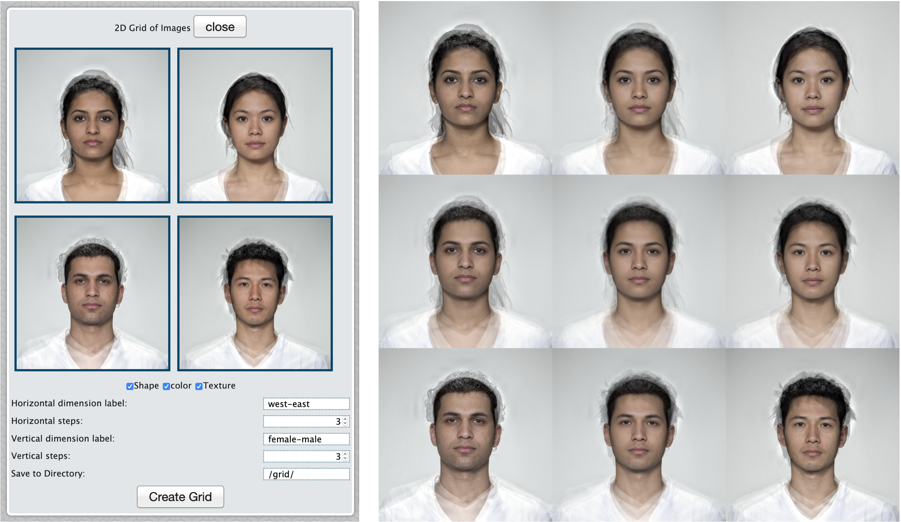
<p class="caption">(\#fig:fig-batch-grid)Image Grid.</p>
</div>

### Multiple Continua

Create multiple morphing continua.

<div class="figure">
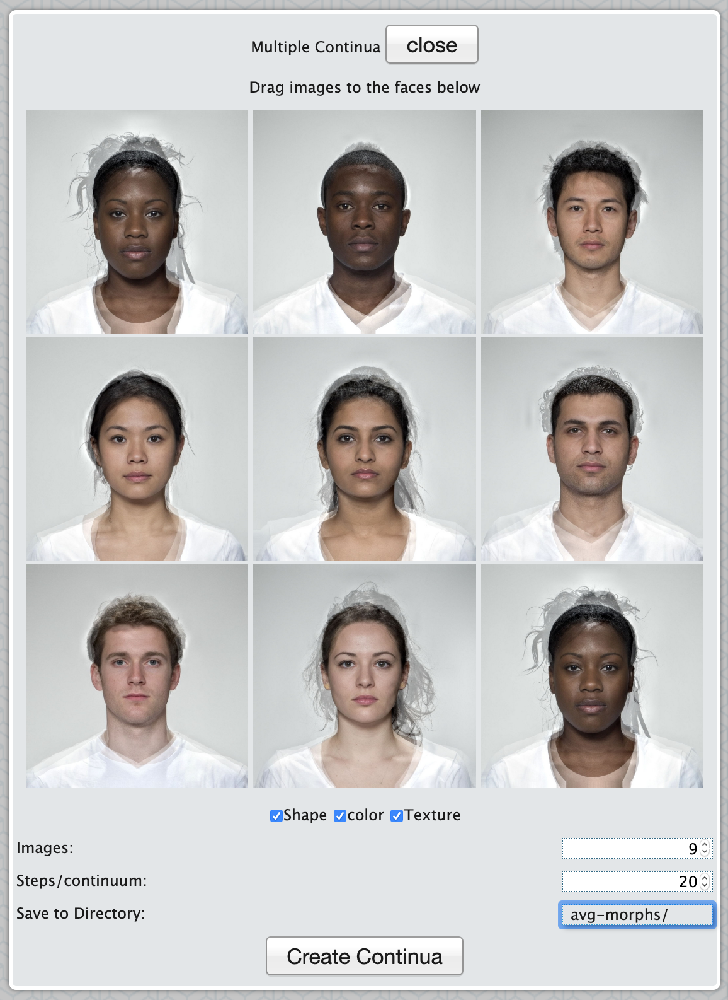
<p class="caption">(\#fig:fig-batch-multiple-continua)Multiple Continua.</p>
</div>


### Moving Gif

Select a set of images, such as a multiple continuum, choose Moving Gif from the Batch menu, and create an animated image.

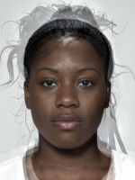
