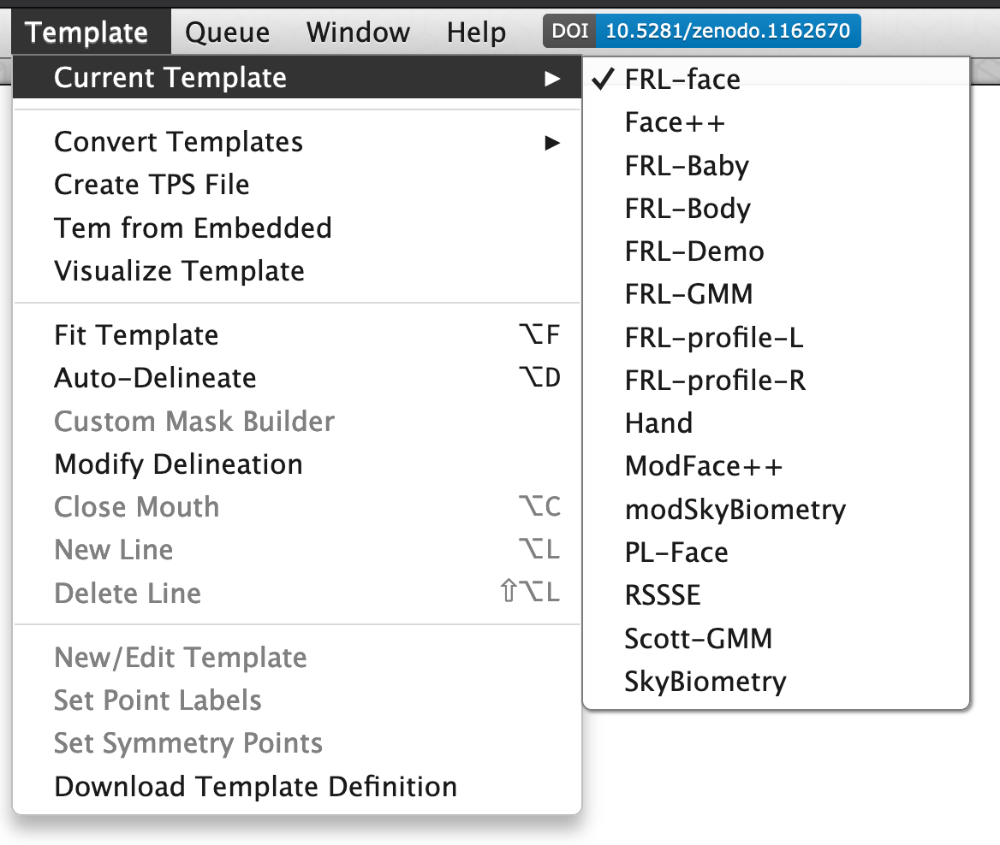
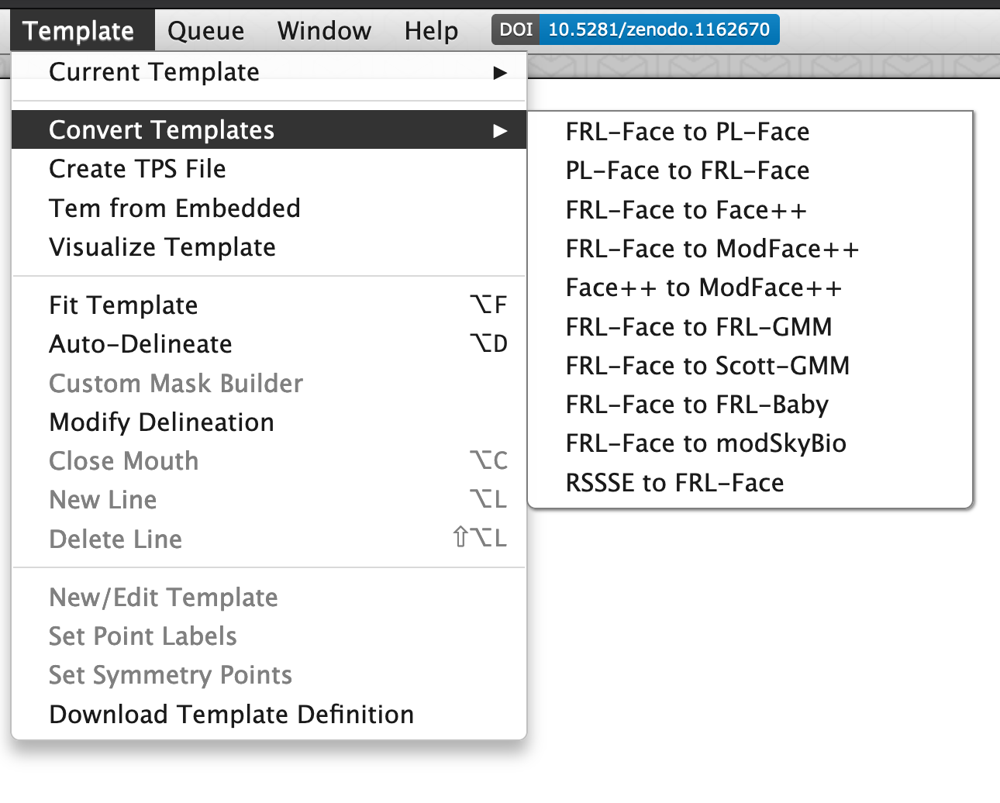
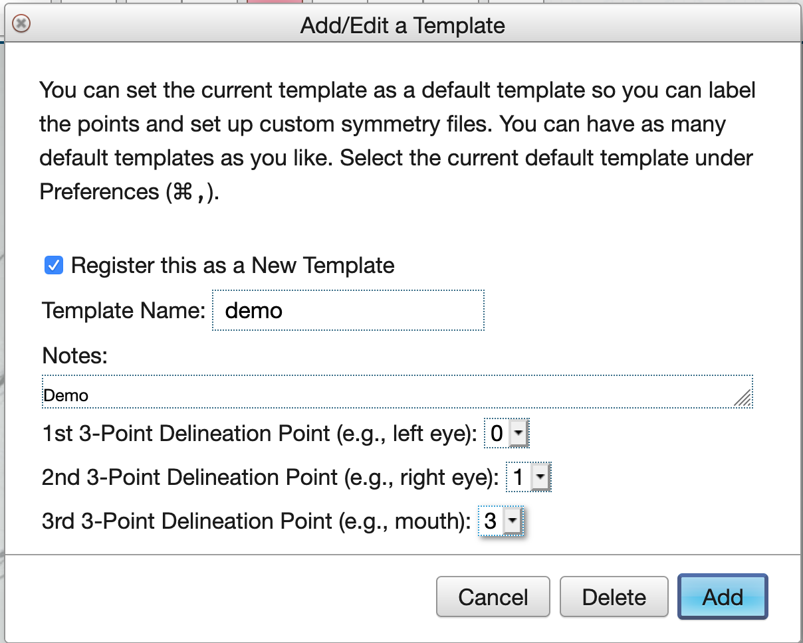

# Templates

## Change Default Template

The template used for new templates will be your default template, which starts as the 189-point FRL-face template, but you can change this in the Preferences  ,). You can see your current template under Current Templates in the Templates menu.

(\#fig:fig-tem-current)Current template and other options.

## Convert Templates

You can convert between a few types of templates, such as FRL-Face (the default 189-point front face template) and PL-Face (a 179-point template commonly used in Dave Perret's Perception Lab). You can convert *to* the auto-delineation template (Face++) but not back yet (it's much easier to remove points from a template than add them.

(\#fig:fig-tem-convert)Tem conversion options

Conversions are usually approximate, as some points are just guessed based on the placement of other points (there is no machine vision going on here), so you should always look through your converted templates and fix any inaccuracies. 

## Create a New Template

This is a buggy process right now, so it might take a few tries. 

Start with an image that has no saved template. You can fit the current template, and then delete it by clicking A to select all points and delete.

First, add new points using click. Use L to start drawing a new line; the cursor will change to a wand. Hover over points until they turn red (you need to move the cursor icon around a bit to find the right point) and click to add them to a line. Click 'enter' to end the line; it will turn from red to blue. Use L to delete a line by clicking on any point attached to the line.

Under the Template menu, choose New/Edit Template. You can set the name, description, and 3 points for initial fitting. I recommend always setting the first three points to the centre of the left eye, centre of the right eye, and centre of the bottom of the top lip to make fitting delineation easier.

(\#fig:fig-tem-new)Save a new template.

