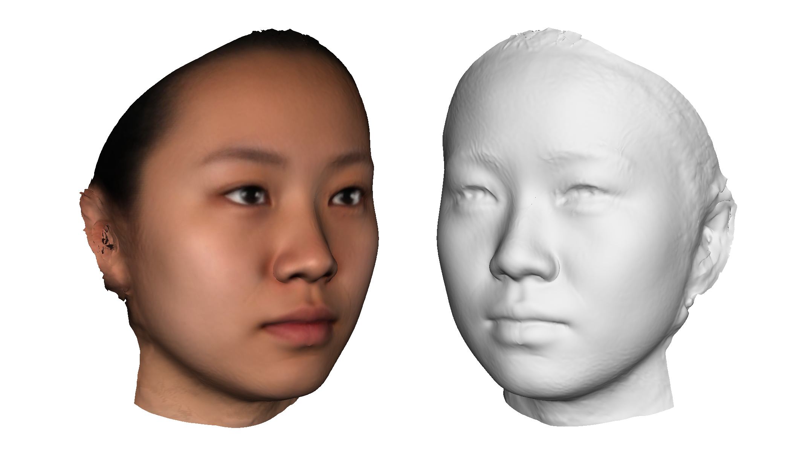

# 3D

The 3D functions are currently under development. You can upload OBJ files and associated BMP or JPEG textures and view them in the 3D Window (3). You can also morph between two objects that have the same geometry.

(\#fig:fig-3d)3D Window.

You can capture frames from moving 3D objects and create animated gifs.

