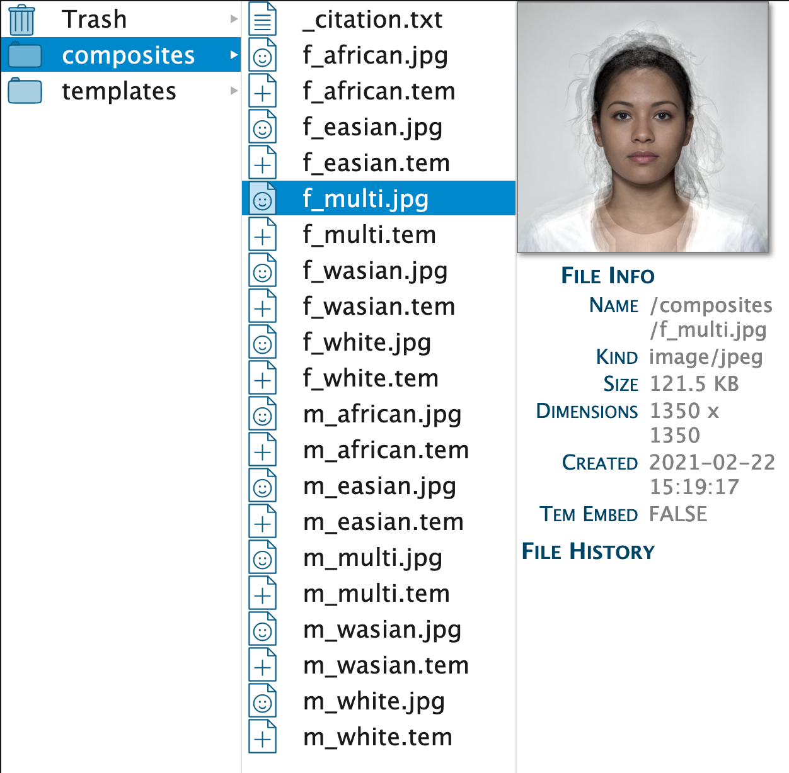
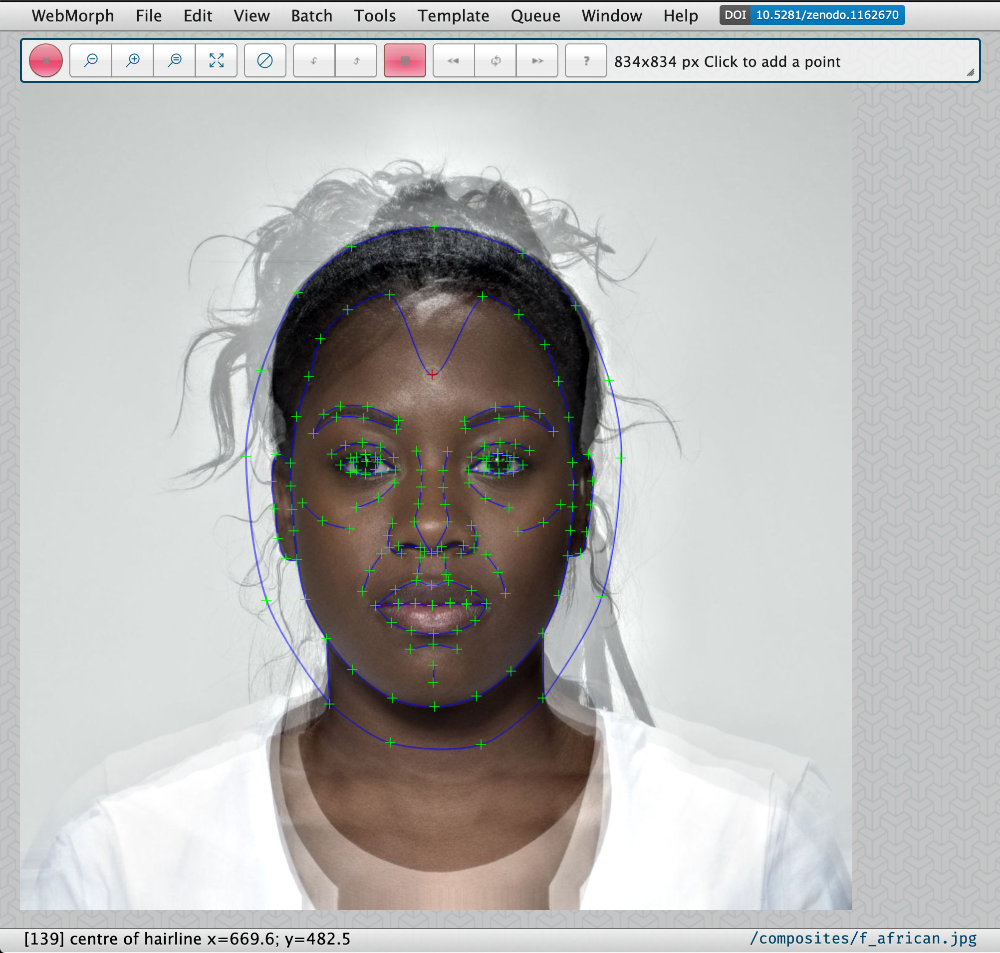
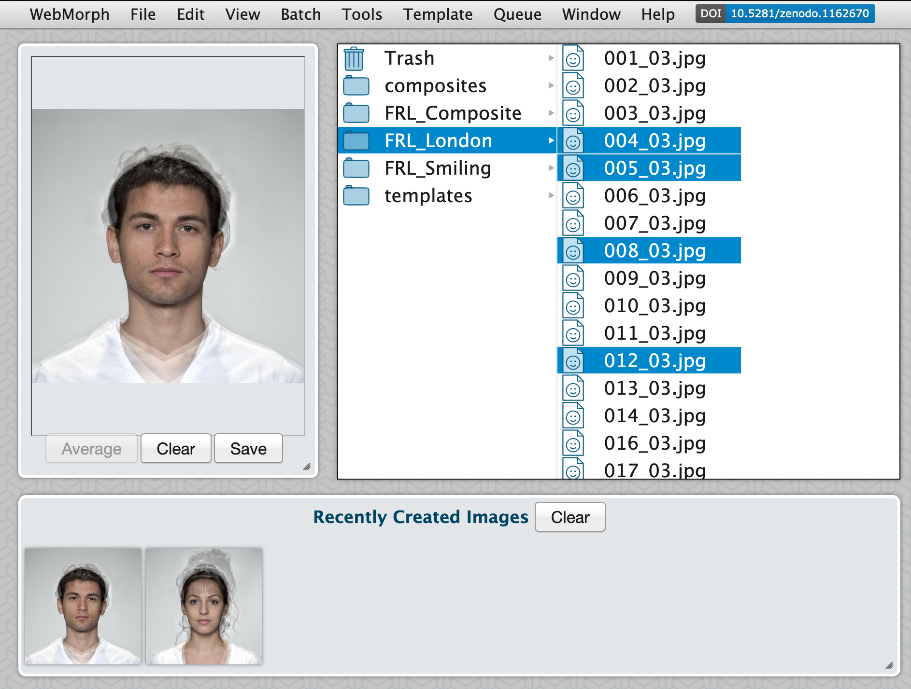
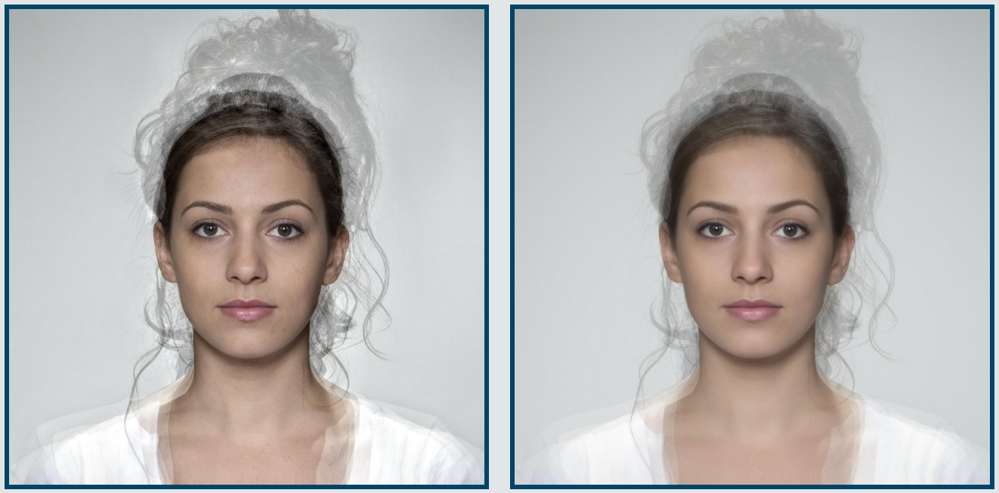
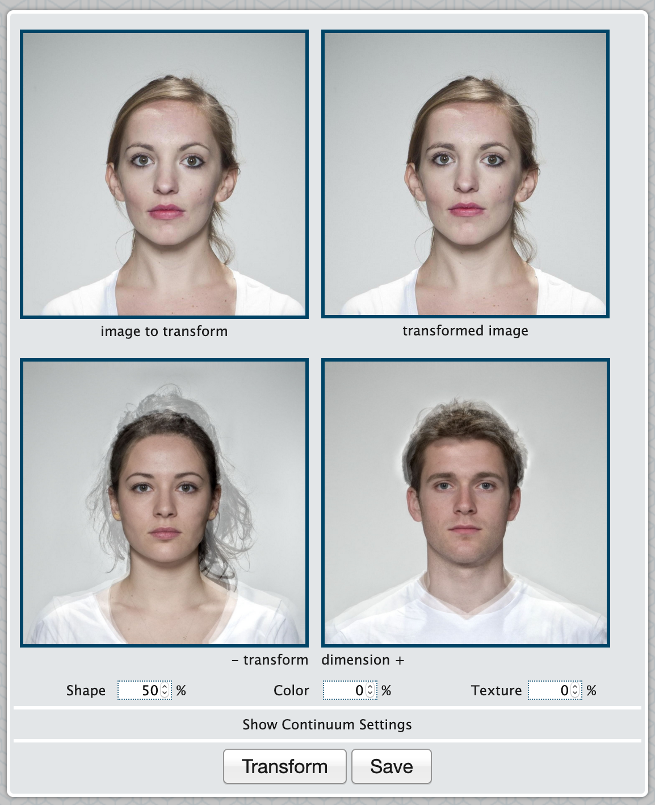
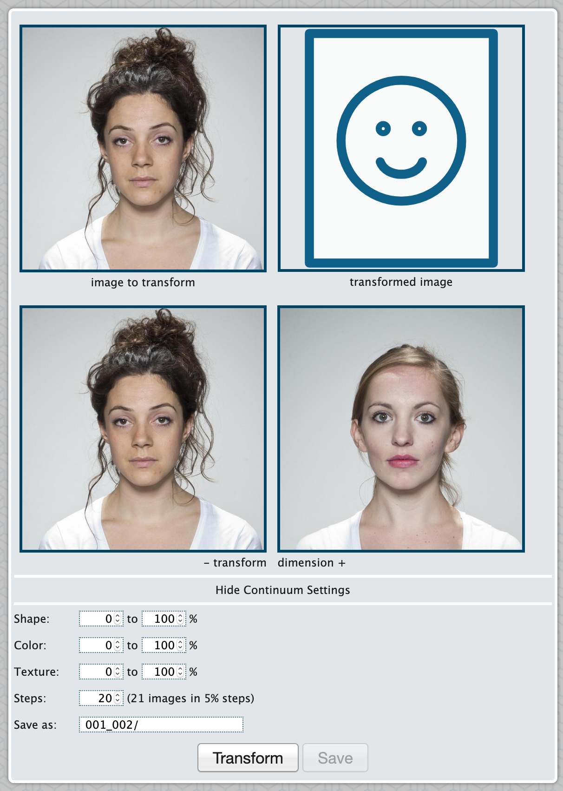

# Getting Started

## Accounts

### Academic Accounts

If you have an academic email address, you should be able to sign up for a free account and be authorised automatically. If your email isn't automatically recognised as academic, email Lisa and ask to be authorised. You will receive your password in an email (check the spam folder if it doesn't arrive in a few minutes).

<div class="info">
These accounts have 265 MB of permanent storage. Contact Lisa if you really need more, but you can always download your files and re-upload them later.
</div>

### Waitlist

There is a currently a waitlist for non-academics. The reason is that letting anyone who wants an account have one would overwhelm the system. We don't currently have any funding, but am to apply for some and expand our capacity as soon as possible.

### Guest Accounts

Anyone can access a guest account. These accounts have limited temporary storage (128 MB) and no permanent storage. You need to download any files you want to keep before you log out. 

### Log in

Once you have your password, log in from the main website page. 

<div class="info">
This web application is a single-page app (which has some advantages for using it on a tablet), but emulates a multi-page app using "fragment identifiers". For example, you can access a file called "f_multi.jpg" in the folder called "composites" in the Finder interface for project 1 at  "https://webmorph.org/#F1/composites/f_multi.jpg" (or you could if you were logged in a someone with permission to access that project)
</div>

## Projects

When you first log in, you are taken to the Projects page (<span class="cmd">6</span>). This page will show all your projects and an overview of their storage and your total allocation.

### New Project

Choose New Project (<span class="shiftcmd">N</span>) from the File menu. Then enter the project name and a description.

Double-click on a project name or description in the project list to edit it.

### Project Users

Click on the last column to add or delete users. Start typing a name or email address and wait for the auto-complete to show you a list of matching users.
<!-- FIX: make process nicer -->
Select the user you want to add and press Enter. The list will reload and then you can click on the last column to check they have been added. An "A" next to the name means they have all permissions to add, delete, and change files. Click on the "A" to change it to "R" for read-only permissions. Click on the "-" to remove this user. Adding users to your project doesn't affect their allocation and you can't remove yourself from a project.

Click on `Go` to load your first project. 

## Finder

Projects open in the Finder interface, which is a file navigation interface like the Mac OS Finder or Windows Explorer. Click on the folders and files to navigate like you would in the Finder on your computer. You can also navigate with the arrow keys.

<div class="info">
If the finder interface starts to look weird or isn't updating the way you think it should, that's probably a bug. Choose Refresh (<span class="cmd">R</span>) under the View menu to reload the Finder.
</div>

New projects come with two folders: `composites` and `templates`. You can also see the Trash (which you can hide under the View menu). 

Click on the `composites` folder and select an image. You should see some file information, including the image dimensions, the date the file was created, and whether it has an embedded template.

```{r fig-finder, echo = FALSE, fig.cap = "Finder window"}

```

If you click on a template file (e.g., "f_multi.tem") you will see similar file information, as well as a small window with the template text. You will probably not ever need to work with these numbers directly, but they are human-readable.

You can upload text files (.txt) to WebMorph for your own records. Their text also displays in the small window if you click on them, but you can't edit them in WebMorph.

The "templates" folder contains tab-separated text files that are used for [batch processing](#batch-processing).

### Built-in Image Sets

WebMorph provides a few open source (CC-BY) image sets for you to use. They are available at FigShare, but also directly through the webmorph interface. 

* `London Face Set (Composites)` [@FRL_Composite] is the same as the `composites` directory that every new project has.
* `London Face Set (Neutral)` [@FRL_London] is images of 102 adult faces with a neutral expression plus templates.
* `London Face Set (Smiling)` [@FRL_London] is the same 102 faces with smiling expressions. There are no templates.
* `3D` are composite images of male and female East Asian and White young adult faces. These can be used to demonstrate the new 3D functions.

Navigate to the place where you want to add the image set and choose the set from Built-In Image Sets in the File menu. Copying the files over can take up to 30 seconds, so be patient (I'm working on fixing this).

### Adding Folders and Files

Create a new folder in the base of your project by clicking underneath all of the folder names to close nay open folders. Then choose New Folder (<span class="shiftcmd">N</span>) from the File menu. Type the new folder name into the pop-up window and click Save.

Add files from your computer by choosing Upload (<span class="cmd">U</span>) from the File menu. You can select multiple files, but not folders to upload. You cannot upload from a zip file yet.

### Uploading from Webcam

You can also upload images from a webcam (<span class="shiftcmd">U</span>). This will bring up a window with the image from your webcam (you may need to give webmorph access first through some permissions pop-ups). Line up your face approximately with the superimposed template and press return to capture the image. Type in a file name and click Save to save it.

### Deleting Files

Select a folder or files (<span class="cmd">click</span> or <span class="shift">click</span> to select multiple files) and choose Move to Trash (<span class="cmd">delete</span>) from the File menu. <span class="shiftcmd">delete</span> skips the confirmation dialog.

### Moving Files

The best way to move files is to cut (<span class="cmd">X</span>) or copy (<span class="cmd">C</span>) and paste (<span class="cmd">V</span>) selected files.

<div class="warning">
You can drag files into another folder, but this can be buggy and I might remove it soon.
</div>

### Renaming Files

Select a file or folder and press Enter, edit the name, and press Enter to accept the new name (or click outside the file to cancel). If you change an image file's name, its associated template file name will also change.

## Delineate

Double-click on an image or template file to open it in the delineation window. The delineation toolbar should be visible. If it's not, choose Delineation Toolbar in the View menu. The question mark button in the toolbar shows a pop-up of helpful hints.

### Fit Template

If an image file does not have an associated template, you will be prompted to 3-point delineate it. A prompt will show in the delineation toolbar to remind you where to click (usually left eye, right eye, and centre of the bottom of the upper lip). If you mess this up, just repeat it by choosing Fit Template (<span class="opt">F</span>) from the Template menu.

### Change Size

You may want to change the size of the image first. You can do this with the buttons in the delineation toolbar or command keys. 

* <span class="cmd">+</span>: increase size
* <span class="cmd">-</span>: decrease size
* <span class="cmd">0</span>: original size
* <span class="cmd">M</span>: fit to the window

### Auto-Delineation

You can automatically delineate a face with the 83-point Face++ template by choosing Auto-Delineate (<span class="opt">D</span>) from the Template menu. You can auto-delineate a batch of images by selecting them in the Finder and doing the same.

<div class="warning">
Don't auto-delineate image that already have template. Delete those files first. If any images in a batch fail (check the Queue menu item), this might be because Face++ is limiting the number of concurrent sessions. Just try to auto-delineate those images again in a minute or two.
</div>

### Delineation

Click on each point and drag it to fit the template to the face. The point number, label, x and y coordinate are shown in the bottom left of the window when you move points. The name of the image is in the bottom right. 

```{r fig-delin, echo = FALSE, fig.cap = "Delineation window."}

```

* Drag each point to delineate the shape of the image.
* <span class="shift">click</span> on a point to select or unselect it.
* <span class="cmd">click</span> or <span class="opt">click</span> on a point to select or unselect the whole line.
* Hold shift and drag over the image select all points inside the box.
* Move a group of selected points by moving any selected point with the mouse or using the arrow keys.
* <span class="opt">+</span> and <span class="opt">-</span> to increase or decrease the size of a selected group of delineation points.
* <span class="opt">←</span> and <span class="opt">→</span> to rotate a selected group of delineation points.
* <span class="cmd">A</span> (or double-click on the image) to unselect all points.


### Save Template

Choose Save (<span class="cmd">S</span>) from the File menu to save the template. It will automatically save with the same name as the associated image.

If you want to scroll through a folder of images, click the Next image (fast forward) button on the delineation toolbar (<span class="cmd">→</span>).

### Size and Normalisation

The size of the average will be taken from the first image in 
the average list.

If images are different sizes, you may want to change the default 
normalisation (under [Preferences](#prefs-normalisation) (<span class="cmd">,</span>) Images) 
from "None" to "2-point" or "Rigid-body".

* None: averages will have all coordinates as the exact 
mathematical average of the coordinates in the component templates
* 2-point: all images are first aligned to the 2 alignment 
points designated in the Default alignment preference. Their 
position is set to their position in the first image in the average
* Rigid-body: procrustes aligns all images to the position of 
the first image in the average list


## Average

Once you have a few images delineated, you're ready to make an average. Select Average (<span class="cmd">4</span>) under the Window menu.

```{r fig-average, echo = FALSE, fig.cap = "Average window."}

```

In this window, only images with associated template files are visible. You can select multiple images, or , if your images are in different folders or you want to include an image more than once (e.g., and average that is 2/3 face A and 1/3 face B), you can drag the images to the average box to add them. Select a listed image and click the delete button to remove it. 

Once your images are selected, click the Average button to create a composite image. The bottom status feed will give you an indicative amount of time this will take, but actual times can be shorter or longer depending on server load.

### Texture 

By default, WebMorph averages are made with texture on. You can change this default in the Images tab of the [Preferences](#prefs-texture-averages) (<span class="cmd">,</span>).

```{r fig-texture, echo = FALSE, fig.cap = "An average of 5 faces. The image on the left has texture on; the image on the right has texture off."}

```

This applies a representative texture to the average, resulting in composite images with more realistic texture instead of the very smooth, bland texture most other averaging programs create. See the papers below for methodological details.

 * B. Tiddeman, M. Stirrat and D. Perrett (2005). Towards realism in facial prototyping: results of a wavelet MRF method. Theory and Practice of Computer Graphics.
 * B. Tiddeman, D.M. Burt and D. Perrett (2001). Computer Graphics in Facial Perception Research. IEEE Computer Graphics and Applications, 21(5), 42-50.
 
### Sample Contours

By default, WebMorph averages are made with sample contours on. You can change this default in the Images tab of the [Preferences](#prefs-sample-contours) (<span class="cmd">,</span>).

This interpolates more control points along the lines. This can improve the accuracy of averages and transforms. If you see a ‘feathery’ appearance along lines that have many, close-together points, try turning this off.


### Saving Averages

Click on the folder you want to save the image into and then click the Save button. Add the image name after the folder path. If you add an image extension (.jpg, .png, or .gif) it will be saved as that file type. If you omit the extension, it will be set to your default extension. You can change this default in the Images tab of the [Preferences](#prefs-default-image-format) (<span class="cmd">,</span>).

You can try out a few averages before you decide which to save. Averages go in the Recently Created Images box where you can click on them to reload them in the average box and save them.

## Transform

Now that you have some averages, you can use the to transform images. Select Transform (<span class="cmd">5</span>) under the Window menu.

```{r fig-transform, echo = FALSE, fig.cap = "Transform window."}

```

The transform interface requires three images: the image to transform, the negative end of the transform dimension, and the positive end of the transform dimension. For example, if you want to alter the sexual dimorphism of an individual's face shape, you would load the individual face in the image to transform box, an average female face in the left transform dimension box, and an average male face in the right transform box.

<div class="info">
We usually try to keep all other demographic and visual aspects of the transform dimension faces the same as the face to transform, as far as possible. Here, we use composite images that are the same (broad) ethnic group as the individual face. They are also young adults and have front-facing, neutral expressions.
</div>

Add image to the boxes by dragging the image, or selecting and image in the Finder and double-clicking the box it should go into in the transform interface. 

Choose the percentage of shape, colour, and texture to transform. For example, 100% adds 100% of the difference between the negative and positive transform dimension images to the individual image, while -50% subtracts 50% of that difference. 

<div class="warning">
Remember, transforming adds or subtracts a percentage of the difference between the transform dimension images to the base image. A 100% transform will not make the base image look exactly like the right transform image.
</div>

You can set shape or colour to 0% to do a colour-only or shape-only transform. Much of the published research on perceptions of masculine and feminine faces uses 50% shape-only transformations like the example above.

### Transform Multiple Images

If you load images into the transform dimension boxes and select more than one image in the Finder, the Transform button changes to Transform All. This sets up a batch file, which will apply this transform to all the selected images.

### Continuum

You can make a continuum, such as transforming from one person to another, using the continuum settings. Set the start and end percentages for shape, colour and texture; the number of steps in your continuum, and the file name to save the images to. Each step will have numbers appended to it.

```{r fig-continuum, echo = FALSE, fig.cap = "Continuum interface."}

```

After you click Transform, the individual frames are sent to the Queue and will appear in the Finder as they are created.


