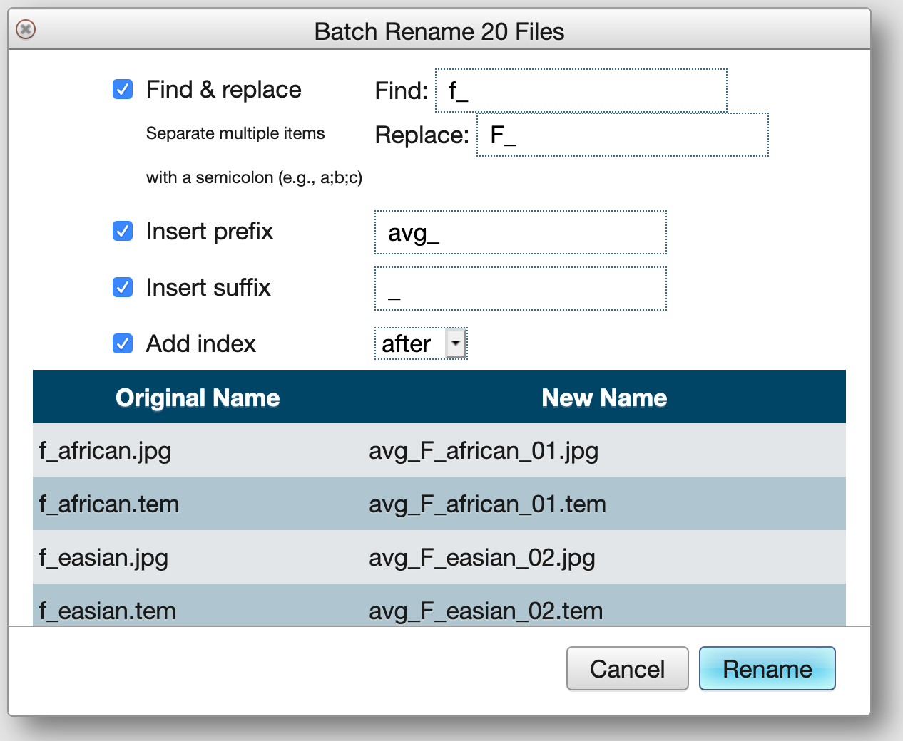
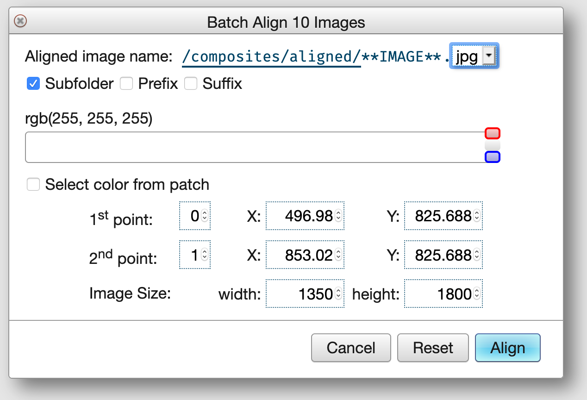
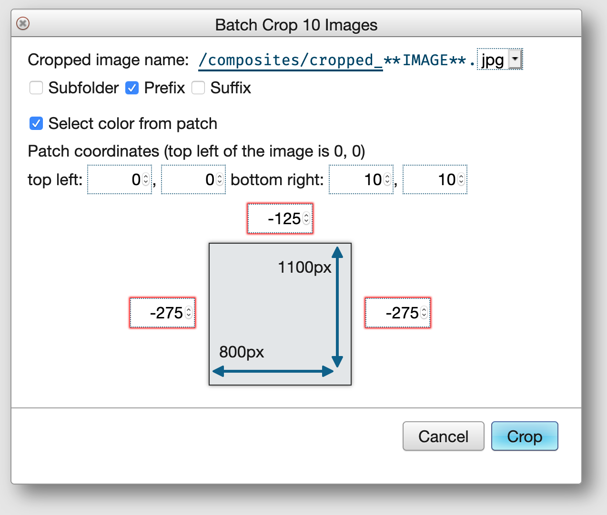
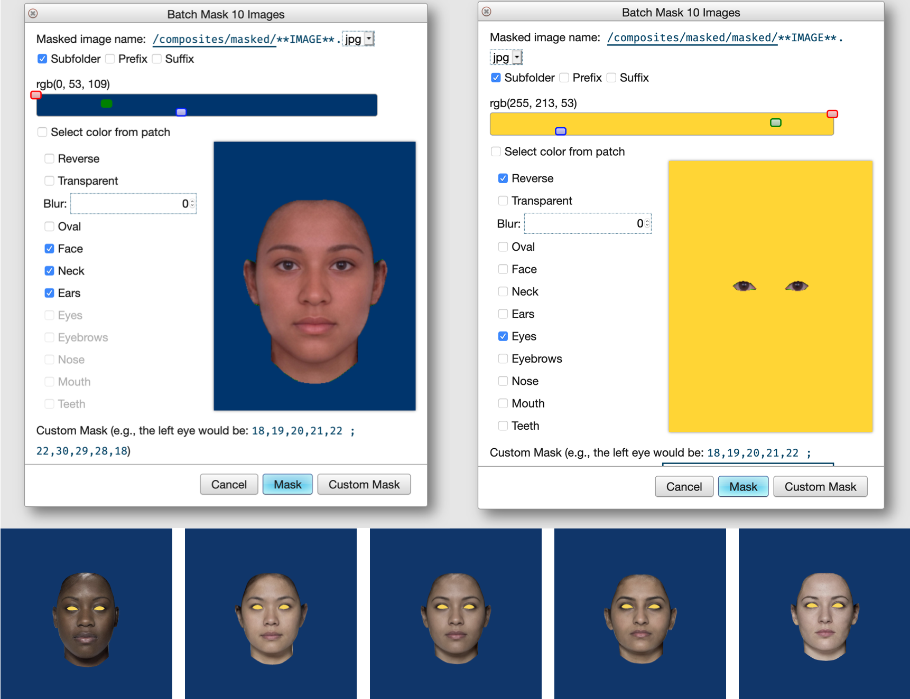
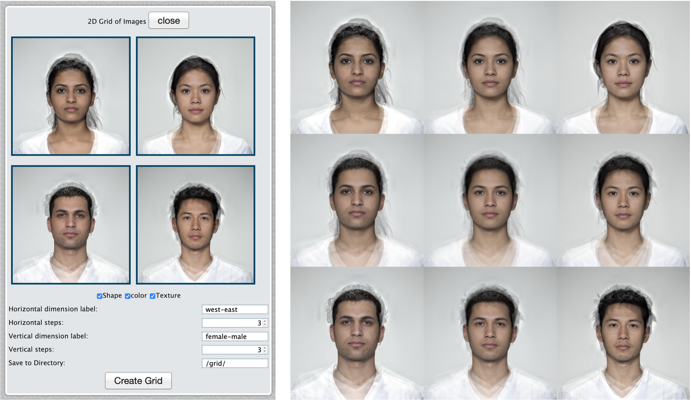
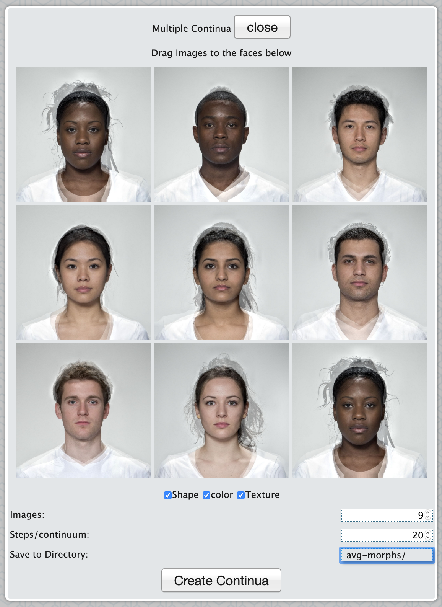

# Batch Processes


## Batch Functions

Select multiple images in the Finder and use the functions under the Batch menu to apply transformations to all of the selected images. The individual processes will be added to the Queue and complete in the background.

<div class="try">
I am writing an [R package](https://facelab.github.io/webmorph/) to do much of this on your own computer, which can often be faster than the webmorph server. 
</div>

### Rename

Replace text, add a prefix or suffix, or add an index to selected images.

```{r fig-batch-rename, echo = FALSE, fig.cap = "Batch Rename."}

```

### Align

Align delineated images on two points. This rotates and resizes images so that the specified points are all in the same place (usually the pupils). 

The default values for the alignment come from [Preferences](#prefs-default-alignment), but you can change them. 

If the alignment makes an image smaller than the image size, the background will be the specified colour.

```{r fig-batch-align, echo = FALSE, fig.cap = "Batch Align."}

```

### Crop

Crop an image by specifying the number of pixels to add or remove from each side.

You can select the background colour for added pixels from the average of a patch of the image whose coordinates you specify (defaulting to the top left 10 pixel square).

```{r fig-batch-crop, echo = FALSE, fig.cap = "Batch Crop."}

```

### Mask

Masking allows you to use the delineation lines to mask off areas of an image. There are several masks built into WebMorph that work with the FRL-Face template, but you can define your own.

```{r fig-batch-mask, echo = FALSE, fig.cap = "Batch Mask."}

```

You can combine masks. The interface will let you visualise what each mask is. Reversing a mask puts the colour inside the mask instead of outside (although the masking interface still shows an external mask, sorry). If you set the mask to transparent, the masked images will be PNGs with transparency.

<div class="warning">
The blur function doesn't work as well as PsychMorph's and you usually can't tell the difference with images that are large.
</div>

### Mirror

Batch mirror mirror-reverses the images and their templates. Templates need to have their symmetry points defined in order to do this. For example, in the FRL-Face template, point 0 is the left pupil and point 1 is the right pupil, so in the mirror-reversed version, the x-coordinates are all flipped and the identities of matching points are swapped so that the pupil point on the left side of the image is 0 in both original and mirror-reversed versions. This is the first step to creating a symmetric face.

### Resize

### Rotate

### Scramble

### Symmetrise

## Batch Files

WebMorph has three types of batch files that let you process many images programmatically.

### Batch Average

[Batch Average Template](https://webmorph.org/include/examples/templates/_batchAvg.txt)

Put the name of each average on the first row and the images in the average in the rows below. Put each average in a new column.

In the example below, the first average is made from two images (m_multi and f_multi) and will be saved in a folder called avg_test as androgynous.jpg. The second example will be made from 4 images, 3 of which are the same (so will be 1/4 f_multi and 3/4 m_multi).

```{r batch-avg, echo = FALSE}
batchAvg <- readr::read_tsv("https://webmorph.org/include/examples/templates/_batchAvg.txt", col_types = 'cc')

options(knitr.kable.NA = '')

knitr::kable(batchAvg)
```


### Batch Transform

[Batch Transform Template](https://webmorph.org/include/examples/templates/_batchTrans.txt)

```{r batch-trans, echo = FALSE}
batchTrans <- readr::read_tsv("https://webmorph.org/include/examples/templates/_batchTrans.txt", col_types = readr::cols())

knitr::kable(batchTrans)
```

### Batch Edit

[Batch Edit Template](https://webmorph.org/include/examples/templates/_batchEdit.txt)

```{r batch-edit, echo = FALSE}
batchEdit <- readr::read_tsv("https://webmorph.org/include/examples/templates/_batchEdit.txt", col_types = readr::cols())

knitr::kable(batchEdit)
```

## Other Functions

### Calculate FacialMetrics

Create CSV files with the Lab* values for each pixel. Check 'ignore mask' to omit pixel values that are the same as the top left pixel color. A CSV file will be created for each image with columns x, y, L , a, and b, with the x and y-coordinates of each pixel and their L*, a and b colour values.

```{r lab, echo = FALSE, results='asis'}
lab <- readr::read_csv("x,y,L,a,b
96,80,90.046,-64.7454,54.8329
96,83,90.1418,-63.9054,53.6131
96,84,90.1522,-63.901,54.5343
96,85,90.1522,-63.901,54.5343
96,86,90.1522,-63.901,54.5343
96,87,89.8794,-63.2933,53.3068
96,89,90.0148,-64.9838,54.7882
96,90,90.0041,-65.1015,55.2222
96,91,90.0148,-64.9838,54.7882")

knitr::kable(lab, caption = "Example rows from an Lab colour file.")
```


### Lab* Pixels

### Image Grid

Make a 2-dimensional grid of images.

```{r fig-batch-grid, echo = FALSE, fig.cap = "Image Grid."}

```

### Multiple Continua

Create multiple morphing continua.

```{r fig-batch-multiple-continua, echo = FALSE, fig.cap = "Multiple Continua."}

```


### Moving Gif

Select a set of images, such as a multiple continuum, choose Moving Gif from the Batch menu, and create an animated image.


