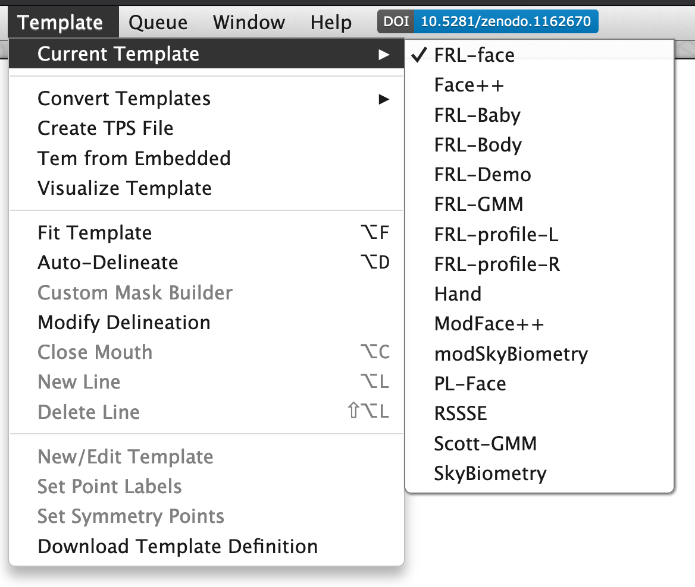
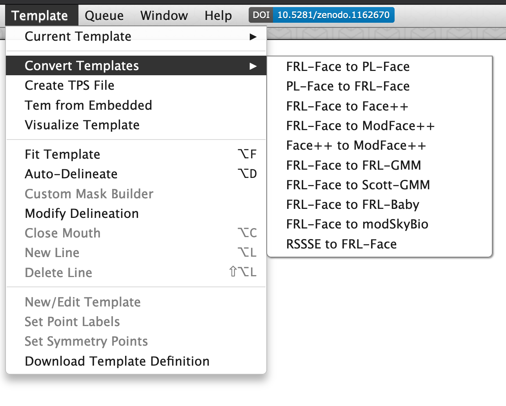
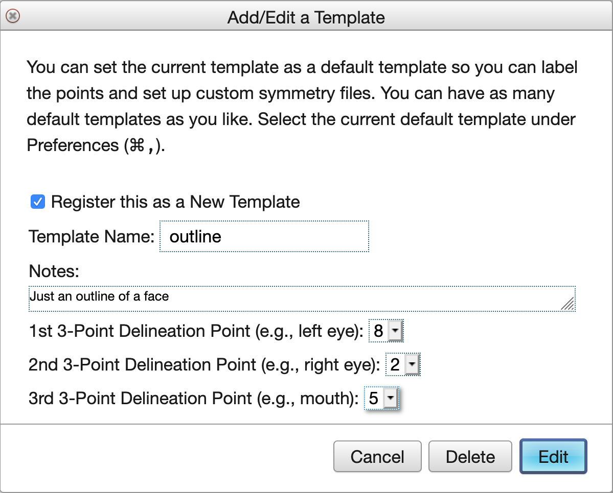

# Templates

## Change Default Template

The template used for new templates will be your default template, which starts as the 189-point FRL-face template, but you can change this in the [Preferences](#prefs-default-template) (<span class="cmd">,</span>). You can see your current template under Current Templates in the Templates menu.

```{r fig-tem-current, echo = FALSE, fig.cap = "Current template and other options."}

```

## Convert Templates

You can convert between a few types of templates, such as FRL-Face (the default 189-point front face template) and PL-Face (a 179-point template commonly used in Dave Perret's Perception Lab). You can convert *to* the auto-delineation template (Face++) but not back yet (it's much easier to remove points from a template than add them.

```{r fig-tem-convert, echo = FALSE, fig.cap = "Tem conversion options"}

```

Conversions are usually approximate, as some points are just guessed based on the placement of other points (there is no machine vision going on here), so you should always look through your converted templates and fix any inaccuracies. 


## Register a New Template {#new-template}

You can register a template you uploaded from another version of 
WebMorph or Psychomorph, or a new one you created here. Registering a template allows you to use it to delineate new images and lets you set the point names and symmetry points.

### From a Saved Template

* Load the image with the template you want to register. 
* Select the three points you want to use for 3-point 
delineation by shift-clicking on them. This only works if you 
select exactly 3 points. I recommend always setting the first three points to the centre of the left eye, centre of the right eye, and centre of the bottom of the top lip to make fitting delineation easier.
* Choose New/Edit Template from the Template menu
* Make sure that "Register this as a new template" is checked, 
unless you are editing one of your previously saved templates. 
You can't edit the public templates that you don't own 
(e.g., FRL-face, FRL-body, Face++).
* Give the template a useful name and notes. The 3 points for 
3-point delineation will be automatically filled in from the points 
you selected. You can change or re-order them here.
* After you save the template, choose "Set Point Labels" from the 
Template menu. Each point will be selected in turn (and an arrow will 
point at it). Type the name into the box at the top of the screen 
and press return.

### From Scratch

If you want to make a template from scratch, start with an image that has no saved template. You can fit the current template, and then delete it by clicking <span class="cmd">A</span> to select all points and <span class="cmd">delete</span>. This is a buggy process right now, so it might take a few tries.

First, add new points using <span class="shiftcmd">click</span>. Use <span class="opt">L</span> to start drawing a new line; the cursor will change to a wand. Hover over points until they turn red (you need to move the cursor icon around a bit to find the right point) and click to add them to a line. Click 'enter' to end the line; it will turn from red to blue. Use <span class="shiftopt">L</span> to delete a line by clicking on any point attached to the line.


```{r fig-tem-new, echo = FALSE, fig.cap = "Save a new template."}

```
