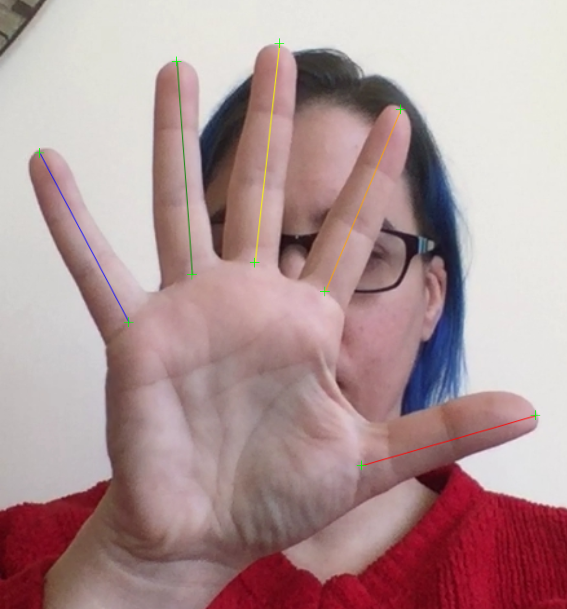
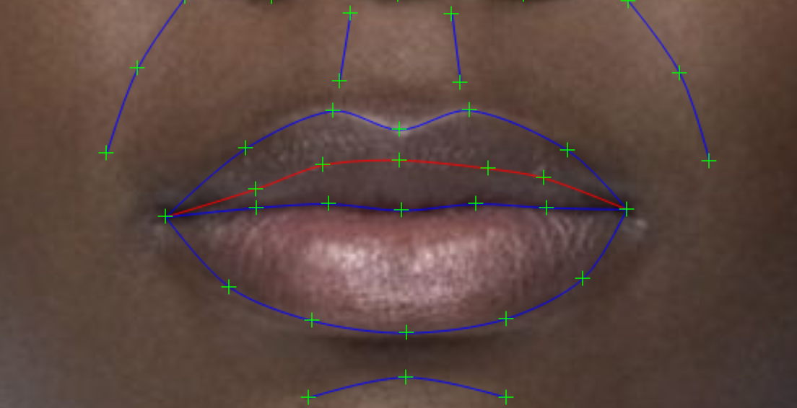
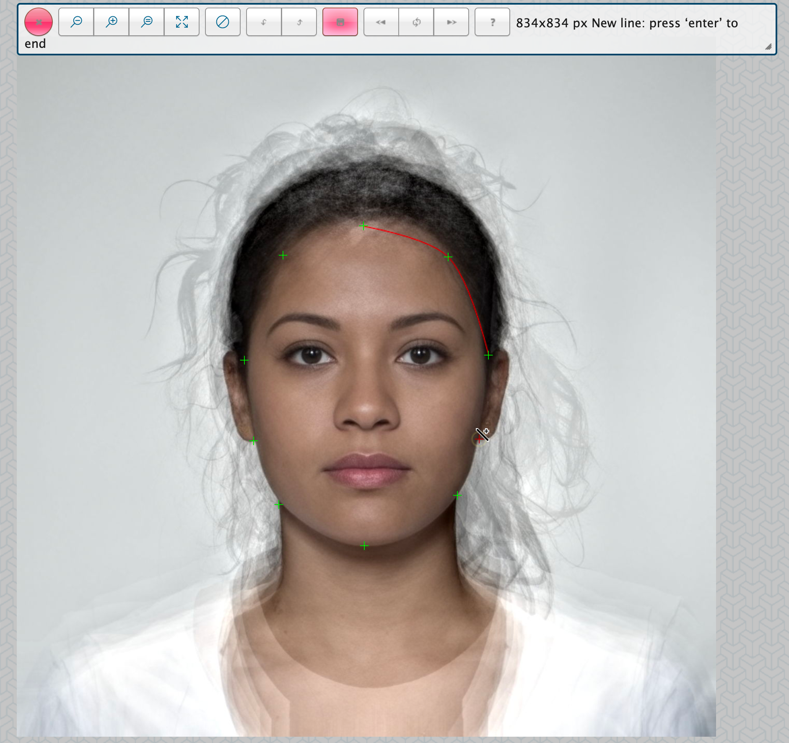
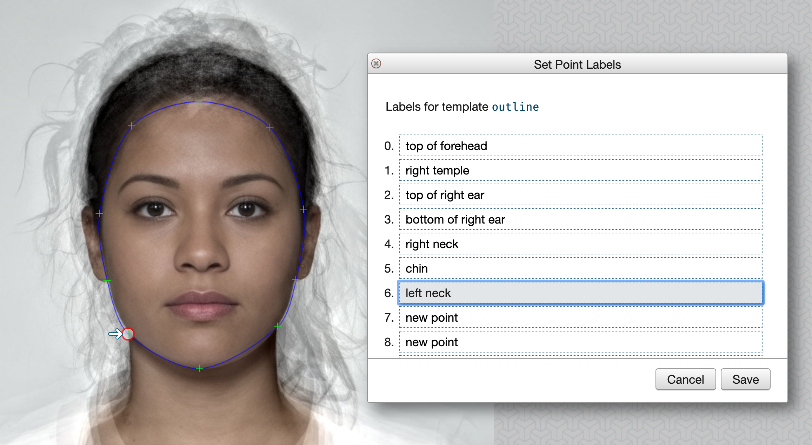
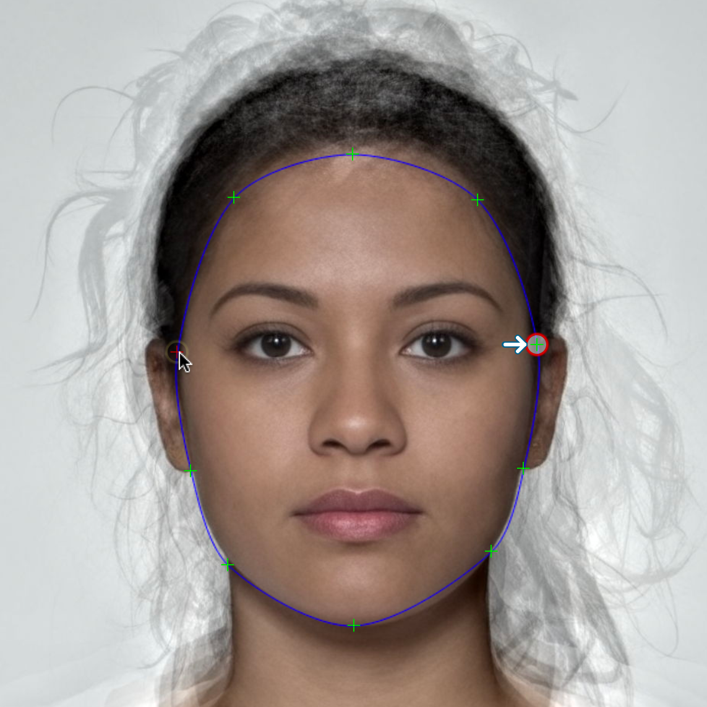

# Templates

## Change Default Template {#default-tem}

The template used for new templates will be your default template, which starts as the 189-point FRL-face template, but you can change this in the [Preferences](#prefs-default-template) (<span class="cmd">,</span>). You can see your current template under Current Templates in the Templates menu.

```{r fig-tem-current, echo = FALSE, fig.cap = "Current template and other options."}
knitr::include_graphics("images/tem_current.png")
```

One unusual template is for hands. You fit the hand template by clicking in the base of the second digit, the tip of the third digit, and the base of the fourth digit. You can use this to [calculate 2D4D](#facialmetrics) for scanned hand images. I'm not sure this line of research means much, but this is a tool that can do it if you must.

```{r fig-tem-hand, echo = FALSE, fig.cap = "Hand Template. Don't measure hands like this; use a flatbed scanner. Or just don't do 2D4D research."}

```

## Delneation

### Close Mouth

In the FRL-Face template, the bottom of the top lip is a red line, while the to of the bottom lip is a blue line (think "blue" = "depressed"). If the face has lips together, you can just delineate the bottom blue line and choose Close Mouth (<span class="opt">C</span>) to move the red line exactly underneath.

```{r fig-tem-close-mouth, echo = FALSE, fig.cap = "The red line is the bottom of the top lip."}

```

## Batch Template Functions

There are several functions under the Template menu that you can apply to all selected templates.

### Convert Templates

You can convert between a few types of templates, such as FRL-Face (the default 189-point front face template) and PL-Face (a 179-point template commonly used in Dave Perret's Perception Lab). You can convert *to* the auto-delineation template (Face++) but not back yet (it's much easier to remove points from a template than add them.

```{r fig-tem-convert, echo = FALSE, fig.cap = "Tem conversion options"}
knitr::include_graphics("images/tem_convert.png")
```

Conversions are usually approximate, as some points are just guessed based on the placement of other points (there is no machine vision going on here), so you should always look through your converted templates and fix any inaccuracies. 

### TPS Files

A TPS file is a way to represent shape data of several images in one file. These are used by geometric morphometric programs like [facefuns](https://iholzleitner.github.io/facefuns/){target="_blank"}. You can create a TPS file by selecting the templates you want to add (any non-template selected files will be ignored) and choosing Create TPS File from the Template Menu. This will save a .tps file in that folder that you can download.

### Tem from Embedded

If a JPEG image is created in webmorph, the template is embedded in the image, so you can recover it even if you deleted the template file. This information, along with the image history, is stored in the EXIF, which can be removed. 

<div class="bug">
All images say that "Tem Embed" is false in the image preview. This is a bug. Also, the built-in images don't have embedded templates. I will fix this when I get time.
</div>

### Modify Delineation

You can batch delete points from selected templates. This is useful if you want to keep only the points appropriate for a geometric morphometric analysis ([facefuns](https://iholzleitner.github.io/facefuns/){target="_blank"} also has a function to do this).

<div class="bug">
The lines usually get messed up when you delete points, so I just delete all the lines, which are seldom used for geometric morphometrics.
</div>


## New Templates {#new-template}

You can register a template you uploaded from another version of 
WebMorph or Psychomorph, or a new one you created here. Registering a template allows you to use it to delineate new images and lets you set the point names and symmetry points.

### From a Saved Template

* Load the image with the template you want to register. 
* Select the three points you want to use for 3-point 
delineation by shift-clicking on them. This only works if you 
select exactly 3 points. I recommend always setting the first three points to the centre of the left eye, centre of the right eye, and centre of the bottom of the top lip to make fitting delineation easier.
* Choose New/Edit Template from the Template menu
* Make sure that "Register this as a new template" is checked, 
unless you are editing one of your previously saved templates. 
You can't edit the public templates that you don't own 
(e.g., FRL-face, FRL-body, Face++).
* Give the template a useful name and notes. The 3 points for 
3-point delineation will be automatically filled in from the points 
you selected. You can change or re-order them here.

```{r fig-tem-new, echo = FALSE, fig.cap = "Save a new template."}
knitr::include_graphics("images/tem_new.png")
```

### From Scratch

If you want to make a template from scratch, start with an image that has no saved template. You can fit the current template, and then delete it by clicking <span class="cmd">A</span> to select all points and <span class="cmd">delete</span>. This is a buggy process right now, so it might take a few tries.

First, add new points using <span class="shiftcmd">click</span>. Use <span class="opt">L</span> to start drawing a new line; the cursor will change to a wand. Hover over points until they turn red (you need to move the cursor icon around a bit to find the right point) and click to add them to a line. Click 'enter' to end the line; it will turn from red to blue. Use <span class="shiftopt">L</span> to delete a line by clicking on any point attached to the line.

```{r fig-tem-edit, echo = FALSE, fig.cap = "Editng points and lines"}

```
Save your template and follow the instructions above for registering a new template. 

### Set Point Labels

After you save the template, choose "Set Point Labels" from the 
Template menu. Each point will be selected in turn (and an arrow will 
point at it). Type the name into the box at the top of the screen 
and press return.

```{r fig-tem-labels, echo = FALSE, fig.cap = "Setting template point labels."}

```

### Setting Symmetry Points {#template-sym}

To set symmetry points for mirroring or symmetrising images, choose Set Symmetry Points from the Template menu. Look for the highlighted point and cmd-click on its corresponding point on the other side. You can move points out of the way to check if they are overlapping. If a point is on the midline, its corresponding point is itself. If you make a mistake, click cmd-Z to go back a point.

```{r fig-tem-sym, echo = FALSE, fig.cap = "Setting symmetry points."}

```